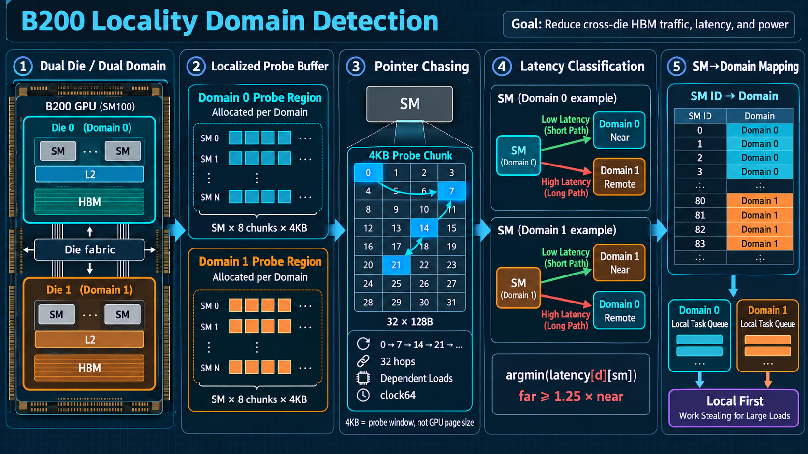

# Discovering B200 Locality Domains with a Pointer-Chasing Probe



NVIDIA Blackwell data-center GPUs are physically multi-die devices. A B200 GPU appears as one CUDA device, but internally its two dies have their own SMs, L2 slices, DRAM controllers, and nearby HBM resources. CUDA models these regions as **locality domains**. Memory remains accessible from either die, but an SM reading memory homed on the other die pays additional fabric latency and power.

DeepGEMM uses this topology to make its persistent Mega MoE kernel locality-aware. It places different slices of the weight matrix in different memory domains, discovers which domain is physically close to every SM, and steers each SM toward the corresponding weight tiles. The implementation is interesting because the small kernel in [`sm100_locality_domain.cuh`](https://github.com/deepseek-ai/DeepGEMM/blob/c7849af/deep_gemm/include/deep_gemm/impls/sm100_locality_domain.cuh) is only the measurement primitive. The complete design also includes localized allocation, launch geometry, statistical classification, topology validation, balancing, and a domain-aware work scheduler.

This note walks through that design and explains why the pointer chain uses a stride of 7.

---

## 1. The topology being discovered

A useful mental model is intra-GPU NUMA:

```text
Locality domain 0 / Die 0             Locality domain 1 / Die 1
┌────────────────────────┐            ┌────────────────────────┐
│ SMs                    │            │ SMs                    │
│ L2 slices              │<--fabric-->│ L2 slices              │
│ DRAM controllers       │            │ DRAM controllers       │
│ nearby HBM resources   │            │ nearby HBM resources   │
└────────────────────────┘            └────────────────────────┘
```

NVIDIA describes each Blackwell locality domain as a physical die with its own L2 cache and DRAM controllers. Cross-domain traffic is functionally valid, but it traverses the inter-die fabric. The optimization target is therefore not correctness; it is reducing remote HBM traffic, latency, and power.

At commit `c7849af`, DeepGEMM makes two target-specific assumptions:

- one CUDA device has exactly two locality domains;
- one TPC contains two adjacent SM IDs, and both SMs belong to the same domain.

The number of domains is encoded as `kNumDeviceLocalityDomains = 2`. Modern CUDA exposes APIs for querying locality-domain counts and constructing localized execution contexts, but this implementation predates direct use of those CUDA 13.4 interfaces and contains compatibility-layer TODOs for them.

---

## 2. First create memory with known locality

The probe can classify an SM only if it has two reference allocations whose physical homes are already known:

```text
probe buffer slice 0 -> memory homed in domain 0
probe buffer slice 1 -> memory homed in domain 1
```

DeepGEMM obtains those allocations through MPS MLOPart. A helper process starts an MPS server in `-mlopart` mode, sees two locality-domain devices, allocates physical memory with `cuMemCreate` on the selected child device, exports the allocation as a POSIX file descriptor, and sends the descriptor back to the main process. The main process imports the handle and maps it into its CUDA virtual address range.

### Allocating localized memory without depending on CUDA 13.4

CUDA 13.4 makes the intended operation direct: pass a `CUmemLocation` of type `CU_MEM_LOCATION_TYPE_DEVICE_LOCALITY_DOMAIN` to `cuMemCreate`, with the physical device and locality-domain index encoded in the location. Earlier CUDA interfaces do not expose that location type, but Blackwell's legacy MPS implementation offers an indirect route. Its **MLOPart** mode—short for *Memory Locality Optimized Partition*—presents each locality domain of one physical GPU as a derived CUDA device. In MPS v3 terminology these are simply called locality domains.

DeepGEMM uses MLOPart only as an allocation helper. The main process does not surrender the full B200 or run the Mega MoE kernel as two isolated MPS jobs:

```text
main process: full B200 CUDA device
    |
    |  request (allocation size, domain index)
    v
helper process under a private MLOPart server
    |
    |  CUDA device 0 == locality domain 0
    |  CUDA device 1 == locality domain 1
    |
    |  cuMemCreate(location = DEVICE, id = domain index)
    |  cuMemExportToShareableHandle(..., POSIX_FD)
    v
POSIX file descriptor sent to the main process over a Unix socket
    |
    |  cuMemImportFromShareableHandle
    |  cuMemAddressReserve + cuMemMap + cuMemSetAccess
    v
ordinary device pointer in the main process, backed by HBM from that domain
```

The apparent trick in the helper's `cuMemCreate` call is that it still uses the old `CU_MEM_LOCATION_TYPE_DEVICE`. The `id` is interpreted inside the MLOPart client's device namespace, where device 0 and device 1 are the two locality-domain devices rather than two physical GPUs. MPS therefore supplies the missing physical placement information.

The implementation has four layers:

1. **Create a private MPS namespace.** The helper creates a temporary `CUDA_MPS_PIPE_DIRECTORY`, launches `nvidia-cuda-mps-control -f` bound to the target physical GPU UUID, and issues `start_server -uid <uid> -mlopart`. Using the UUID avoids accidentally changing the target when device ordinals are remapped.
2. **Allocate in the selected MLOPart device.** The client verifies that it sees the expected two derived devices. For a request `(num_bytes, domain_idx)`, it creates an exportable pinned allocation with `location = {DEVICE, domain_idx}` and `requestedHandleTypes = POSIX_FILE_DESCRIPTOR`.
3. **Transfer the allocation, not a device pointer.** A CUDA virtual address is process-local, so the helper exports the VMM physical-allocation handle and passes its file descriptor with Unix-domain-socket ancillary data. The main process imports that descriptor as a `CUmemGenericAllocationHandle` and closes the descriptor after the import.
4. **Map it into the full-device process.** The main process reserves an aligned virtual-address range, maps one or more imported domain-specific handles into it, and grants read/write access to the physical B200 device. Compute can then use the whole GPU while the software scheduler directs each SM toward the locally backed portion of the address range.

A simplified version is:

```cpp
// Helper running as an MLOPart client.
CUmemAllocationProp prop{};
prop.type = CU_MEM_ALLOCATION_TYPE_PINNED;
prop.requestedHandleTypes = CU_MEM_HANDLE_TYPE_POSIX_FILE_DESCRIPTOR;
prop.location = {CU_MEM_LOCATION_TYPE_DEVICE, domain_idx};

CUmemGenericAllocationHandle physical;
cuMemCreate(&physical, aligned_bytes, &prop, 0);
cuMemExportToShareableHandle(&fd, physical,
                             CU_MEM_HANDLE_TYPE_POSIX_FILE_DESCRIPTOR, 0);
send_fd_to_parent(fd);

// Main process, which still sees the complete GPU.
cuMemImportFromShareableHandle(&physical, fd,
                               CU_MEM_HANDLE_TYPE_POSIX_FILE_DESCRIPTOR);
cuMemAddressReserve(&va, aligned_bytes, granularity, 0, 0);
cuMemMap(va, aligned_bytes, 0, physical, 0);
cuMemSetAccess(va, aligned_bytes, &full_device_rw_access, 1);
```

Several details are required for a robust implementation:

- Query `cuMemGetAllocationGranularity` and align both the reservation and every physical mapping. The 4KB probe chunk is unrelated to VMM allocation granularity.
- Request an exportable handle at allocation time; a normal `cudaMalloc` allocation cannot be retrofitted into this flow.
- Keep the imported generic allocation handle alive until after `cuMemUnmap`; then call `cuMemRelease` and finally `cuMemAddressFree`.
- Treat MLOPart as a locality mechanism, not an isolation boundary like MIG. Both domains belong to one physical GPU and the resulting mapping is deliberately made accessible to the full device.
- Detect MPS/MLOPart startup failure and retain a correctness-preserving non-localized path. DeepGEMM warns and disables localization when the helper is unavailable.

This removes the **CUDA 13.4 API dependency**, but not every platform dependency: the compatibility path requires a driver and GPU with MLOPart support, the MPS control daemon, CUDA VMM export/import support, and POSIX file-descriptor IPC. It is therefore a practical Linux/Blackwell bridge rather than a portable replacement for the newer locality-domain API.

The logical probe-buffer shape is:

```text
[num_domains, num_sms, chunks_per_sm, chunk_bytes]
       2          S             8          4096
```

Every SM receives eight private 4KB chunks in each domain. Private chunks reduce contention between probing CTAs and provide several independent samples for a median.

The important distinction is that **4KB is the pointer-chasing window, not the allocation or GPU page size**. The containing VMM allocation is much larger. DeepGEMM queries `cuMemGetAllocationGranularity`, rounds each domain slice to the returned minimum granularity, and maps that aligned physical allocation. CUDA VMM granularity is platform- and allocation-property-dependent; it must not be inferred from the 4KB benchmark chunk.

---

## 3. Constructing the 4KB pointer chain

DeepGEMM defines:

```cpp
static constexpr int kNumLocalityDomainProbeChunkBytes = 4096;
static constexpr int kNumLocalityDomainProbeLineBytes = 128;
static constexpr int kNumLocalityDomainProbeHops = 4096 / 128;  // 32
```

Each 4KB chunk is treated as 32 logical lines of 128 bytes. Only the first 32-bit word of each line matters. It stores the word offset of the next line:

```cpp
next_line = (current_line + 7) % 32;
```

The resulting traversal begins:

```text
0 -> 7 -> 14 -> 21 -> 28 -> 3 -> 10 -> 17 -> ... -> 0
```

The first load obtains the initial index. Every timed load then uses the value returned by the previous load as its address. This creates a true dependency chain: the GPU cannot issue all loads independently and hide their latency with memory-level parallelism.

### Why stride 7?

The source comment gives the essential rule: the stride must be coprime with the line count. For a modular walk

```text
line(i) = (line(0) + i * stride) mod N
```

the number of distinct visited lines is:

```text
N / gcd(stride, N)
```

Here `N = 32` and `gcd(7, 32) = 1`, so the chain visits all 32 lines before repeating. A bad stride demonstrates the failure mode immediately:

```text
stride 8: 0 -> 8 -> 16 -> 24 -> 0
```

Only four lines are visited because `gcd(8, 32) = 8`.

The fact that 7 is prime is incidental. **Primality is neither necessary nor sufficient; coprimality with the ring size is the actual requirement.** Because 32 is a power of two, every odd stride is valid, including composite strides such as 9 or 15. Conversely, the prime stride 2 would be invalid because it shares a factor with 32.

Why choose 7 instead of the simpler stride 1? DeepGEMM does not document a second formal requirement, so this part should be treated as engineering inference: stride 7 preserves the full-cycle property while making the address order non-sequential. That helps the probe look less like a streaming scan and reduces sensitivity to mechanisms that recognize adjacent access patterns. It also gives a deterministic permutation without storing a separate random index table.

There is one subtle detail. The kernel reads line 0 before starting `clock64()`, uses the returned pointer to begin at line 7, and performs 32 timed hops. The final timed hop returns to line 0, which may still be cached. The dominant signal nevertheless comes from the other lines; one potentially warm hop contributes only one thirty-second of the average.

---

## 4. Launching exactly one probe CTA per SM

The JIT wrapper launches:

```text
gridDim.x  = number of SMs
blockDim.x = 32 threads
dynamic shared memory = the SM100 shared-memory capacity
```

Consuming the full shared-memory capacity limits residency to one probe CTA per SM. With exactly as many CTAs as SMs, the launch covers the device one SM at a time. The kernel reads the physical `%smid` special register rather than assuming that `blockIdx.x` is an SM number.

Only thread 0 performs the pointer chase. This is intentional: a warp-wide or block-wide load stream would measure throughput, coalescing, and queueing effects rather than the latency of a single serialized path.

The load primitive is:

```cpp
ld.global.cg.u32
```

The `.cg` cache operator avoids normal L1 caching and uses the global/L2 path. Before probing, the host writes a 256MiB temporary tensor to displace the initialized chains from L2. For every private chunk, the kernel measures 32 dependent hops with `clock64()` and stores cycles per hop.

Conceptually, the raw result is:

```text
latency[domain][sm][chunk]
```

---

## 5. Turning noisy latency into an SM-to-domain map

For each `(domain, SM)` pair, DeepGEMM takes the median of the eight chunk measurements. It then sorts the two domain latencies for each SM and chooses the faster domain:

```text
sm_domain[sm] = argmin(domain_latency[:, sm])
```

The tentative map is accepted only when both checks pass:

1. **Clear separation:** every SM must satisfy `far >= 1.25 * near`.
2. **TPC consistency:** the two SMs in each TPC must receive the same domain ID.

The ratio test prevents a small amount of clock noise from being mistaken for topology. The TPC check adds a structural invariant from the target architecture. If either test fails, the probe retries, up to five attempts.

If no stable attempt succeeds, DeepGEMM emits a warning and falls back to an even TPC-level assignment:

```text
TPC 0 -> domain 0
TPC 1 -> domain 1
TPC 2 -> domain 0
TPC 3 -> domain 1
...
```

This fallback remains functionally correct because remote domain memory is still accessible. It merely loses some or all of the locality benefit.

---

## 6. Physical topology versus a balanced scheduling map

The directly measured map represents physical proximity. DeepGEMM also constructs a balanced map for the Mega MoE scheduler.

If the enabled TPC count is unevenly distributed between the two physical domains, assigning work strictly by physical ownership gives one domain more workers than the other even though the weight matrix is split into equal halves. That can create a scheduling tail. The balancing pass therefore moves the smallest possible number of whole TPCs from the larger logical group to the smaller one until both groups contain half of the SMs.

Those reassigned TPCs deliberately accept remote accesses. This is a trade-off:

- strict physical mapping minimizes every individual memory path;
- balanced logical mapping reduces queue imbalance and kernel tail latency.

The implementation exposes both maps, but Mega MoE consumes the balanced one.

---

## 7. How Mega MoE consumes the result

Localized weights are reshaped from a logical tensor such as:

```text
[experts, N, K]
```

into:

```text
[domain=2, experts, N/2, K]
```

Slice 0 is backed by domain-0 memory and slice 1 by domain-1 memory. The TMA descriptor represents the domain split as another tensor dimension.

Inside the persistent Mega MoE kernel, each CTA pair reads:

```cpp
domain = sm_locality_domains[smid];
```

It first increments the task counter for its local domain. Domain 0 tasks cover the first half of the N tiles; domain 1 tasks cover the second half. The resulting `n_cluster_idx` determines `half_idx`, which becomes the domain coordinate in the TMA weight load. The software scheduler therefore connects the measured physical topology to the correct localized weight slice.

The policy is locality-first rather than locality-only:

- while the local queue contains work, an SM consumes local tiles;
- after the local queue drains, work stealing is allowed for sufficiently large workloads;
- for small workloads, stealing is disabled because avoiding a few idle SMs may not justify remote-memory latency and power.

This preserves load balance without discarding the topology signal.

---

## 8. What the probe does—and does not—measure

The pointer chase is deliberately a latency probe, not a bandwidth benchmark. It answers a narrow question:

> For this SM, which known localized allocation has the shorter serialized global-memory path?

It does not directly measure:

- peak HBM bandwidth per die;
- aggregate inter-die fabric bandwidth;
- TMA throughput under a real GEMM pipeline;
- the CUDA VMM page size;
- the exact physical address-to-HBM-channel mapping.

That narrowness is a strength. The runtime only needs a robust binary classification, not a complete reverse-engineered topology.

---

## 9. Design lessons

Several general GPU-systems lessons fall out of this small probe:

1. **Create known physical anchors before inferring topology.** Two localized allocations give the latency experiment labels it can compare against.
2. **Serialize the phenomenon being measured.** A dependent pointer chain exposes latency that parallel loads would hide.
3. **Use modular arithmetic to cover the working set.** The important property of stride 7 is `gcd(7, 32) = 1`, not primality.
4. **Validate with architectural invariants.** The 1.25x gap and TPC-pair agreement turn a noisy microbenchmark into a reliable classifier.
5. **Keep physical topology separate from scheduling policy.** The measured map records proximity; the balanced map makes an explicit throughput trade-off.
6. **Treat locality as a performance hint, not a correctness boundary.** Remote accesses and fallback assignments remain valid.
7. **Do not confuse benchmark size with memory-management granularity.** The 4KB chunk is a probe window; VMM allocation granularity is queried independently.

The final mechanism is a compact feedback loop:

```text
localized allocations
        -> per-SM pointer-chasing latency
        -> validated SM-to-domain map
        -> balanced domain-aware queues
        -> mostly local TMA weight loads
```

That is the larger design hidden behind the twenty-line probe kernel.

---

## References

- [DeepGEMM SM100 locality-domain probe kernel](https://github.com/deepseek-ai/DeepGEMM/blob/c7849af/deep_gemm/include/deep_gemm/impls/sm100_locality_domain.cuh)
- [DeepGEMM host-side probing and classification](https://github.com/deepseek-ai/DeepGEMM/blob/c7849af/csrc/apis/locality_domain.hpp)
- [DeepGEMM probe launch wrapper](https://github.com/deepseek-ai/DeepGEMM/blob/c7849af/csrc/jit_kernels/impls/sm100_locality_domain.hpp)
- [DeepGEMM localized VMM allocator](https://github.com/deepseek-ai/DeepGEMM/blob/c7849af/csrc/runtime/locality_domain.hpp)
- [DeepGEMM MLOPart C++ import bridge](https://github.com/deepseek-ai/DeepGEMM/blob/c7849af/csrc/runtime/mlopart.hpp)
- [DeepGEMM MPS MLOPart helper](https://github.com/deepseek-ai/DeepGEMM/blob/c7849af/deep_gemm/utils/mlopart.py)
- [DeepGEMM Mega MoE scheduler](https://github.com/deepseek-ai/DeepGEMM/blob/c7849af/deep_gemm/include/deep_gemm/scheduler/mega_moe.cuh)
- [CUDA Programming Guide: Locality Domains](https://docs.nvidia.com/cuda/cuda-programming-guide/04-special-topics/locality-domains.html)
- [CUDA Programming Guide: Virtual Memory Management](https://docs.nvidia.com/cuda/cuda-programming-guide/04-special-topics/virtual-memory-management.html)
- [NVIDIA MPS: When to use locality domains/MLOPart](https://docs.nvidia.com/deploy/mps/when-to-use-mps.html)
- [NVIDIA MPS v3 interface and terminology](https://docs.nvidia.com/deploy/mps/mpsv3-interface.html)
- [NVIDIA: Accelerating Data Processing with Locality Domains](https://developer.nvidia.com/blog/accelerating-data-processing-with-nvidia-multi-instance-gpu-and-numa-node-localization/)
