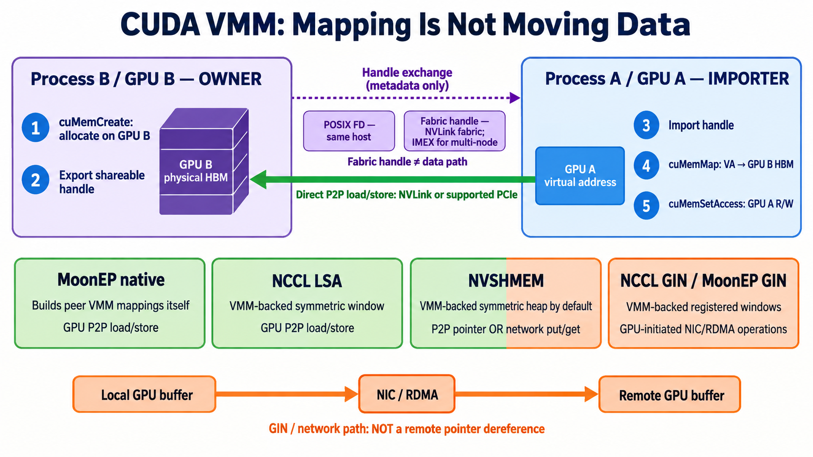

# CUDA VMM and GPU Communication Layers

CUDA virtual memory management (VMM) maps a GPU virtual address to a physical allocation; mapping alone does not transfer data. The owner creates GPU memory with `cuMemCreate` and exports a shareable handle. Another process receives the handle, imports it, calls `cuMemMap`, and grants its GPU access with `cuMemSetAccess`. Its kernel can then load or store through that address when a supported P2P path exists.

A **POSIX FD** shares the allocation between processes on one host. A **fabric handle** can also be exchanged across nodes in the same NVLink fabric, with IMEX configured. Neither handle is the data path: direct accesses travel over NVLink/NVSwitch or supported PCIe P2P.

The software layers use this foundation differently:

- **MoonEP native** builds the VMM peer mappings itself and accesses remote memory from its kernels.
- **NCCL LSA** exposes peer load/store pointers through VMM-backed symmetric windows.
- **NVSHMEM** uses CUDA VMM for its dynamic symmetric heap by default; communication may use a P2P pointer or a network transport.
- **NCCL GIN / MoonEP GIN** use registered, VMM-backed windows, but move remote data through GPU-initiated network operations rather than dereferencing a remote GPU pointer.

References: [CUDA VMM](https://docs.nvidia.com/cuda/cuda-programming-guide/04-special-topics/virtual-memory-management.html), [NCCL Device API](https://docs.nvidia.com/deeplearning/nccl/user-guide/docs/usage/deviceapi.html), [NVSHMEM memory management](https://docs.nvidia.com/nvshmem/api/latest/gen/api/memory.html).
