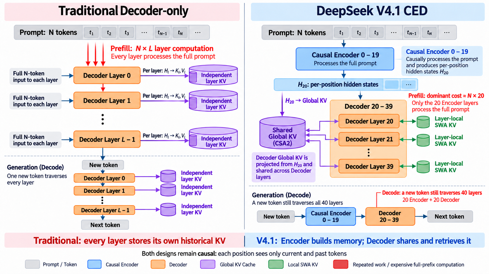
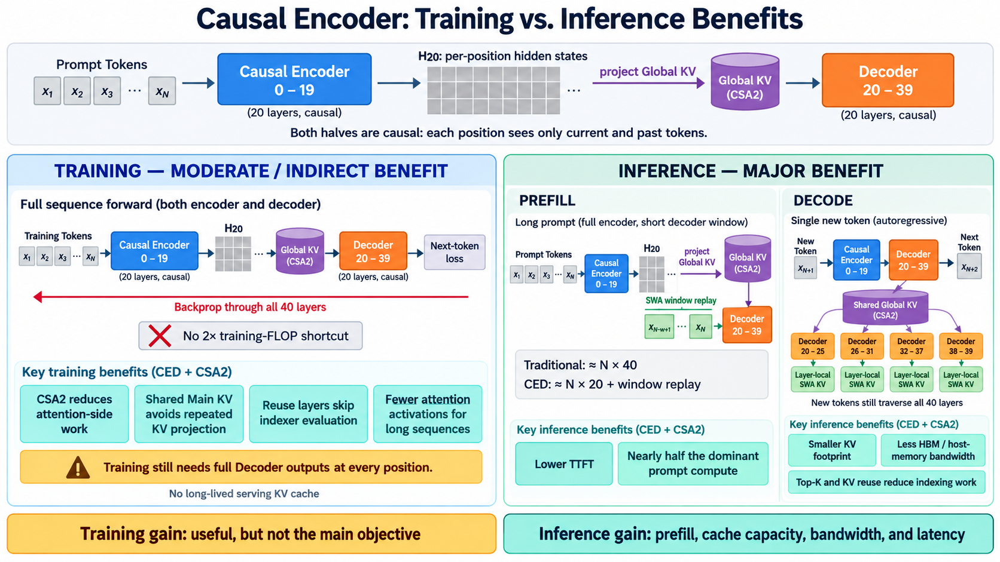

# DeepSeek V4.1 CED and CSA2 Architecture Notes

## TL;DR

- DeepSeek V4.1-Flash is still an autoregressive causal language model, but its
  40 Transformer blocks are split into a 20-layer **causal encoder** and a
  20-layer **decoder**.
- The causal encoder processes the full prompt and produces `H20`, a sequence
  of per-position hidden states. `H20` is not one pooled vector and is not the
  twentieth token.
- Decoder global KV is projected from `H20`. In the released CSA2 schedule,
  decoder layer 20 owns the shared global KV, while later decoder layers reuse
  it.
- Every decoder layer still computes its own query, attention output, and
  layer-local sliding-window KV. Sharing global KV does not mean copying an
  earlier layer's attention output.
- CED primarily improves inference prefill. CSA2 improves both training and
  inference, but its largest deployment benefit is reducing KV-cache capacity,
  indexing work, memory traffic, and persistent cache storage.
- Unlike DeepSeek V4, which alternates CSA and HCA, DeepSeek V4.1-Flash uses
  pure CSA2 for its global attention path.

## 1. From DSA to CSA2

The three mechanisms are best understood as successive reductions along the
sequence and layer dimensions.

| Mechanism | Candidate representation | Sparse selection | Cross-layer reuse | Main purpose |
| --- | --- | --- | --- | --- |
| DSA | One original KV entry per token | Select top-k original token entries | No | Reduce core-attention work |
| CSA | Learned compressed KV entries | Select top-k compressed entries | No | Reduce core-attention work, indexer work, and KV size |
| CSA2 | Simplified compressed KV entries | Select or reuse top-k compressed entries | Main KV, indexer K, and top-k indices | Reduce work and cache duplication across both sequence and layer dimensions |

For a sequence of length `N` and compression ratio `m`, DSA indexes roughly
`N` token entries, while CSA and CSA2 index roughly `N / m` compressed entries.
CSA can therefore be summarized as "compress, then apply sparse attention."
CSA2 adds layer-dimension sharing on top of that design.

## 2. CED versus a traditional decoder-only stack



A conventional decoder-only model uses a homogeneous stack. During prefill,
every prompt position traverses every layer, and every layer derives its own KV
history from its own hidden states.

DeepSeek V4.1-Flash instead divides the backbone into:

| Layer range, zero-based | Role | Full-prompt responsibility |
| --- | --- | --- |
| 0-19 | Causal encoder | Processes the full prompt and produces `H20` |
| 20-39 | Decoder | Retrieves global memory derived from `H20` and maintains layer-local SWA state |

Both halves remain causal. This is not a BERT-style bidirectional encoder and
not a traditional T5-style encoder-decoder system. At position `t`, the
encoder representation can depend only on positions up to `t`.

## 3. What `H20` means

Let `H0` be the token embedding sequence. With zero-based block numbering:

```text
block 0:  H0  -> H1
block 1:  H1  -> H2
...
block 19: H19 -> H20
```

For batch size `B`, sequence length `N`, and hidden dimension `d`, the boundary
state is a sequence tensor:

```math
H_{20} \in \mathbb{R}^{B \times N \times d}.
```

Each row `H20[t]` is the causal representation of the prefix ending at position
`t`. The model preserves one representation per sequence position rather than
pooling the prompt into one vector.

The decoder global memory is derived from this boundary state:

```math
C^{\mathrm{global}} = f_{\mathrm{KV}}(H_{20}).
```

The exact path also includes CSA2 compression when the configured ratio is
greater than one, quantization, and indexer-K projection.

## 4. Does the decoder have its own KV?

The answer depends on which KV path is meant.

| Quantity | Source | Shared across decoder layers? |
| --- | --- | --- |
| Main query | Current decoder layer hidden state | No |
| Long-range global KV | Projected from `H20`; owned by the decoder Full layer | Yes |
| Indexer K | Projected from the shared main KV | Yes |
| Top-k indices | Produced by Full/Reindex or reused by Reuse | Shared within each index group |
| Local SWA KV | Current decoder layer hidden state | No |

Conceptually, decoder layer `l` performs:

```math
Q_l = f^Q_l(H_l),
```

followed by attention over both selected global entries and the layer's own
local sliding-window state:

```math
O_l = \mathrm{Attention}
\left(
Q_l,
\left[
C^{\mathrm{global}}_{\mathrm{selected}};
C^{\mathrm{SWA}}_l
\right]
\right).
```

The decoder therefore does **not** keep one independent long-range global KV
cache per layer, but it does keep independent layer-local SWA KV. Every layer
also produces a new query and a new attention output. A decoder query attends
to KV projected from `H20`, not directly to the raw `H20` tensor.

## 5. The three CSA2 modes

All three modes compute a layer-specific main query, layer-local SWA KV, sparse
attention, and output projection. They differ only in how they obtain global
KV, indexer state, and sparse positions.

| Mode | Main KV and indexer K | Top-k selection | Work saved |
| --- | --- | --- | --- |
| Full | Generated by the current layer | Fresh indexer evaluation | None; this is the owner/source layer |
| Reindex | Reused from the latest Full layer | Fresh selection using this layer's indexer Q | Avoids a new global KV cache while allowing retrieval to change with depth |
| Reuse | Reused from the latest Full layer | Reuses the latest compatible Full/Reindex selection | Avoids both KV generation and indexer evaluation |

`Reuse` does not skip attention. It reuses the memory and selected positions,
but the current layer still assigns its own attention weights and produces its
own output.

## 6. Released V4.1-Flash layer schedule

The released configuration statically assigns the modes as follows:

| Layers | Section | Compression ratio | Mode pattern |
| --- | --- | ---: | --- |
| 0-1 | Encoder | None | SWA only |
| 2-7 | Encoder | 2 | Full + 5 Reuse |
| 8-13 | Encoder | 2 | Full + 5 Reuse |
| 14-19 | Encoder | 2 | Full + 5 Reuse |
| 20-23 | Decoder | 1 | Full + 3 Reuse |
| 24-27 | Decoder | 1 | Reindex + 3 Reuse |
| 28-31 | Decoder | 1 | Reindex + 3 Reuse |
| 32-35 | Decoder | 1 | Reindex + 3 Reuse |
| 36-39 | Decoder | 1 | Reindex + 3 Reuse |

The four global-KV owners are layers `2`, `8`, `14`, and `20`. The index-source
layers are `2`, `8`, `14`, `20`, `24`, `28`, `32`, and `36`. This yields:

- 2 SWA-only layers;
- 4 Full layers;
- 4 Reindex layers; and
- 30 Reuse layers.

The encoder compresses pairs of positions into global entries. The decoder
uses compression ratio one: it does not merge adjacent positions, but it still
benefits from sparse selection, cross-layer KV sharing, index reuse, and FP4
global-KV storage.

## 7. Hierarchical indexing in the decoder

Decoder layer 20 is the only decoder Full layer. It scans the full causally
visible global history, chooses its final top-512 entries, and also builds a
larger candidate pool for later Reindex layers.

The released settings use 2,048 selected blocks with eight positions per
block, producing at most 16,384 candidate positions. Layers 24, 28, 32, and 36
select their own top-512 entries from this bounded pool rather than rescanning
the entire context. The three Reuse layers after each index-producing layer
reuse that layer's top-512 selection.

The first decoder indexer still scales with context length. The deeper Reindex
layers have a bounded search domain once the candidate-pool size is fixed.

## 8. Training versus inference benefits



### Training

Standard next-token training needs a final decoder output at every sequence
position, followed by backward propagation through the complete network. CED
therefore does not provide the same near-2x shortcut that it provides for
inference prefill.

Training can still benefit from CSA2 because:

- compressed and sparse attention reduces attention-side work on long
  sequences;
- shared main KV avoids repeated KV projections;
- Reuse layers avoid new indexer evaluations; and
- fewer attention-side intermediates may need to be retained or recomputed.

These gains are not free. In pipeline-parallel training, source and consumer
layers can reside on different stages, so DeepSeek uses shadow indexers,
cross-stage payloads, gradient synchronization, and microbatch-level shared
state management.

Training activations should also not be confused with a serving KV cache.
Training tensors generally live for a forward/backward step, whereas an
inference KV cache persists across autoregressive generation steps and may be
stored in HBM, host memory, or SSD for prefix reuse.

### Inference prefill

For a long prompt, a traditional 40-layer decoder-only model performs roughly
`N x 40` layer-token work. CED lets the full prompt primarily traverse the
20-layer causal encoder. Decoder global KV is projected from `H20`, while the
decoder SWA path replays only a bounded recent window.

The dominant long-prompt work is therefore approximately:

```math
N \times 20 + n_{\mathrm{win}} \times 20,
```

which approaches `N x 20` when the prompt is much longer than the local window.
This is primarily a time-to-first-token and prompt-processing optimization.

### Autoregressive decode

Each newly generated token still traverses all 40 backbone layers. CED does not
turn decode into a 20-layer path. The deployment benefits instead come from:

- shared global KV rather than one independent long-range cache per decoder
  layer;
- FP4 global-KV storage;
- top-k sparse reads;
- bounded candidate searches for deeper Reindex layers;
- index reuse in Reuse layers; and
- small layer-local SWA caches.

DeepSeek reports a global KV footprint of 890 bytes per token, about one quarter
of DeepSeek V4-Flash at the same sequence length. SWA Bounded Replay further
reduces persistent cache storage to roughly one eighth of V4-Flash by avoiding
the need to persist the full layer-wise SWA state.

## 9. Practical mental model

A useful summary is:

```text
causal encoder = build a reusable per-position memory representation
decoder       = query that global memory and maintain local layer state
CSA2          = compress, sparsify, and share the global memory across layers
```

Or, in terms of what each mechanism primarily saves:

```text
CED           -> long-prompt prefill compute
CSA2          -> attention work, indexer work, and cross-layer KV duplication
FP4 global KV -> cache capacity and memory bandwidth
bounded replay-> persistent SWA-cache storage
```

## References

- [DeepSeek-V4.1-Flash: Pushing the Limits of KV Cache Compression](https://arxiv.org/abs/2609.19969)
- [DeepSeek-V4.1-Flash model and inference configuration](https://huggingface.co/deepseek-ai/DeepSeek-V4.1-Flash)
- [DeepSeek-V4: Towards Highly Efficient Million-Token Context Intelligence](https://arxiv.org/abs/2606.19348)
- [DeepSeek-V3.2: Pushing the Frontier of Open Large Language Models](https://arxiv.org/abs/2512.02556)
