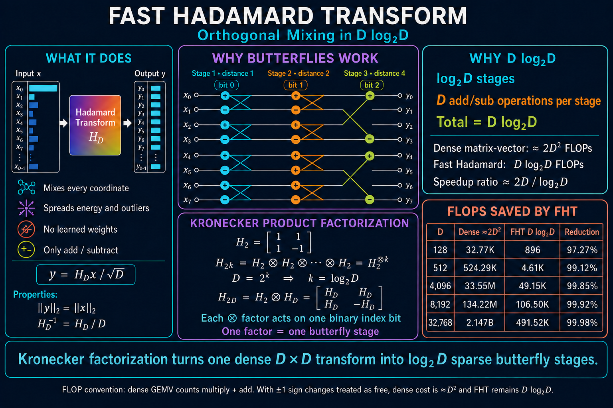
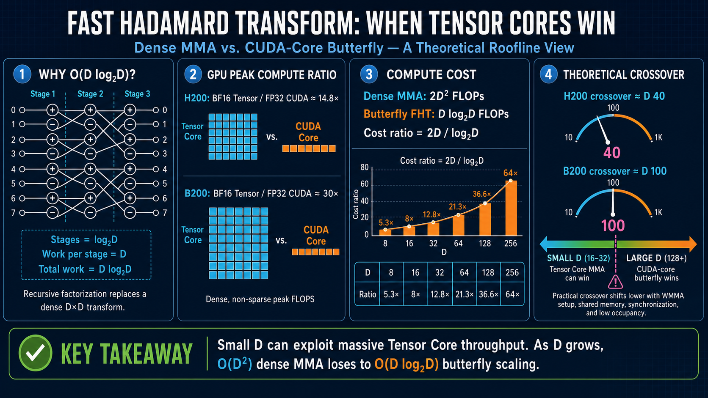
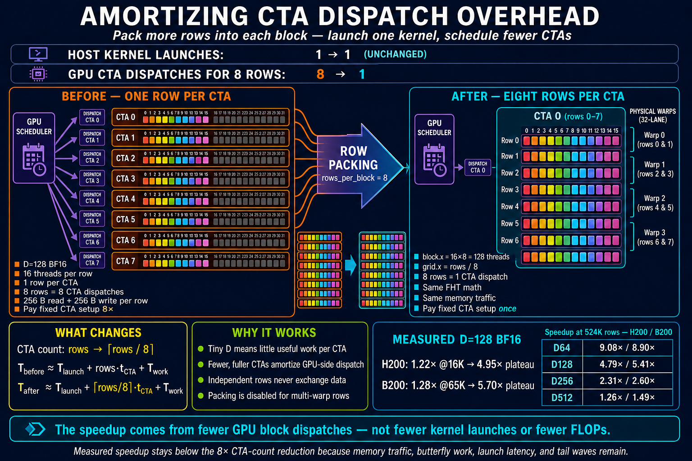

# Engineering a Fast Hadamard Transform on Modern NVIDIA GPUs

## Butterfly Factorization, Hierarchical Communication, and CTA-Dispatch Amortization

The Fast Hadamard Transform (FHT) is an unusually attractive primitive for modern machine-learning systems. It provides a deterministic orthogonal mixing operation, requires no learned parameters, and replaces a dense matrix-vector product with a sequence of simple additions and subtractions.

The mathematical algorithm is compact. The GPU implementation is not. A useful kernel must map several different communication scopes—registers, warp shuffles, shared memory, and independent thread-blocks—onto the recursive butterfly structure. It must also avoid a less obvious performance trap: when the transform dimension is small, launching one tiny cooperative thread array (CTA) per row can cost more than the arithmetic itself.

This article describes a CuTeDSL implementation of the power-of-two FHT, explains its hierarchical execution flow, and studies a targeted optimization that packs multiple rows into one CTA. Across the benchmarked `D=64…512` shapes, this reduces the number of CTAs by 4–16× and produces measured speedups of up to 5.7× for `D=128` and roughly 9× for `D=64` on B200/H200-class GPUs. The policy supports still larger packing factors for the smallest dimensions.



---

## 1. What the Hadamard transform does

The order-two Hadamard matrix is

$$
H_2 =
\begin{bmatrix}
1 & 1 \\
1 & -1
\end{bmatrix}.
$$

Larger power-of-two Hadamard matrices are constructed with Kronecker products:

$$
H_{2^k} = H_2^{\otimes k}.
$$

Equivalently,

$$
H_{2D}
= H_2 \otimes H_D
=
\begin{bmatrix}
H_D & H_D \\
H_D & -H_D
\end{bmatrix}.
$$

For an input vector $x \in \mathbb{R}^D$, the normalized transform is

$$
y = \frac{1}{\sqrt{D}} H_D x.
$$

Because $H_D H_D^T = D I$, the normalized transform preserves the Euclidean norm:

$$
\lVert y \rVert_2 = \lVert x \rVert_2.
$$

In machine-learning workloads, this makes the FHT useful as a cheap orthogonal rotation. It mixes every output coordinate with every input coordinate, redistributes concentrated energy and outliers, and requires neither learned weights nor a stored dense matrix.

---

## 2. Why the complexity is $D\log_2D$

The Kronecker factorization exposes the butterfly primitive

$$
(a,b) \longrightarrow (a+b, a-b).
$$

At each stage, the transform applies $D/2$ butterflies. Each butterfly produces two results with two add/subtract operations, so every stage performs exactly $D$ arithmetic operations.

The pairing distance doubles after every stage:

```text
stage 0: distance 1
stage 1: distance 2
stage 2: distance 4
...
stage k-1: distance D/2
```

For $D=2^k$, there are $k=\log_2D$ stages. Therefore,

$$
\text{FHT work} = D\log_2D.
$$

A conventional dense GEMV costs approximately $2D^2$ FLOPs when multiplication and addition are both counted. The FHT therefore changes the asymptotic work from $O(D^2)$ to $O(D\log D)$.

| $D$ | Dense GEMV, $\approx2D^2$ | FHT, $D\log_2D$ | FLOP reduction |
|---:|---:|---:|---:|
| 128 | 32.77K | 896 | 97.27% |
| 512 | 524.29K | 4.61K | 99.12% |
| 4,096 | 33.55M | 49.15K | 99.85% |
| 8,192 | 134.22M | 106.50K | 99.92% |
| 32,768 | 2.147B | 491.52K | 99.98% |

If multiplication by `+1` or `-1` is treated as a free sign operation, the dense baseline is closer to $D^2$ additions rather than $2D^2$ FLOPs. The asymptotic conclusion remains unchanged.



---

## 3. Mapping one FHT row to the GPU

Consider a row-major input tensor with logical shape `[rows, D]`. The power-of-two kernel decomposes the transform dimension as

$$
D = n_{\text{chunks}} \times n_{\text{threads}} \times n_{\text{elts}}.
$$

Each logical row is cooperatively processed by `n_threads` threads. Each thread owns `n_chunks × n_elts` values in registers. The implementation uses:

- `n_elts = 8` for FP16/BF16, because eight 16-bit values fill one 128-bit transaction;
- `n_elts = 4` for FP32, because four 32-bit values fill one 128-bit transaction;
- 128-bit vectorized global loads and stores (`LDG.128` and `STG.128`);
- FP32 registers for butterfly arithmetic, followed by a cast at the final store.

The transform then follows the GPU communication hierarchy.

```text
GMEM load
   ↓
thread-local register butterflies
   ↓
intra-warp shuffle butterflies
   ↓
inter-warp shared-memory exchange
   ↓
cross-chunk register butterflies
   ↓
GMEM store
```


### 3.1 Thread-local butterflies

The first `log₂(n_elts)` stages operate entirely inside one thread. Every operand is already in a register, so these are the lowest-latency butterfly stages and require no synchronization.

Conceptually, each thread independently applies $H_{n_{\text{elts}}}$ to every chunk it owns.

### 3.2 Intra-warp butterflies

The next stages exchange values between lanes in the same warp. A butterfly partner is selected with an XOR distance:

```text
partner_lane = lane_id XOR (1 << stage)
```

CUDA implements this exchange with `SHFL.XOR`-style warp shuffles. The sign of the result is determined by the corresponding bit in the logical thread index:

```text
low half:   self + partner
high half:  partner - self
```

Because warp shuffles do not require shared memory or a CTA-wide barrier, this remains an efficient communication path.

### 3.3 Inter-warp butterflies

Warp shuffles cannot cross a 32-lane warp boundary. For transforms that use multiple warps per row, the kernel performs a shared-memory transpose:

1. Scatter the register values to shared memory using the original `(warp, lane)` coordinates.
2. Synchronize the CTA.
3. Read them back using transposed coordinates.
4. Perform the formerly cross-warp butterfly as an ordinary intra-warp shuffle.
5. Scatter and gather again to restore the canonical layout.

The implementation uses XOR-adjusted shared-memory addresses to reduce bank conflicts. If the complete register tile does not fit in the configured shared-memory exchange buffer, the operation is divided into multiple chunk-exchange rounds.

### 3.4 Cross-chunk butterflies

For large dimensions, each thread owns more than one chunk. The remaining $H_{n_{\text{chunks}}}$ factor is local to that thread and can therefore be implemented with register arithmetic alone.

The thread-local, thread-index, warp-index, and chunk-index transforms are separable Kronecker factors. Their mathematical order can be changed, but their placement can still affect compiler scheduling and physical-register allocation. That distinction becomes important later.

---

## 4. The small-$D$ bottleneck is not arithmetic

For a conventional one-row-per-CTA kernel,

$$
N_{\text{CTA}} = N_{\text{rows}}.
$$

This mapping is natural for large transforms: a row supplies enough arithmetic and memory traffic to justify a CTA. It becomes inefficient for small $D$.

For example, the BF16 `D=128` kernel uses only 16 logical threads per row. One CTA therefore contains half of a warp and moves only 256 input bytes plus 256 output bytes. Its register butterflies complete quickly, and it needs neither inter-warp communication nor shared memory.

At that point, performance is dominated by fixed costs:

- GPU CTA dispatch and block scheduling;
- block state allocation and retirement;
- tail waves across the SM array;
- the fixed kernel-call/runtime floor for small total workloads.

The implementation uses an order-of-100-nanoseconds fixed scheduling cost per CTA as a useful optimization model, not as a universal hardware constant. The exact value depends on architecture, residency, runtime state, and the surrounding block stream. A sub-microsecond per-block cost becomes a millisecond-scale effect when a kernel dispatches millions of tiny CTAs.

It is important to distinguish two different overheads:

> **The optimization below does not reduce the number of host kernel launches. It reduces the number of CTAs dispatched inside one kernel launch.**

The host still launches one FHT kernel. The GPU simply has fewer, fuller CTAs to schedule.

---

## 5. Packing multiple rows into one CTA

When a row needs at most one warp (`n_threads <= 32`), multiple independent rows can safely share one physical CTA. The implementation targets 128 physical threads per CTA:



```python
if n_threads > 32:
    rows_per_block = 1
else:
    rows_per_block = 128 // n_threads
```

This gives the following mapping:

| Example BF16/FP16 $D$ | Logical threads per row | Rows per CTA | CTA-count reduction |
|---:|---:|---:|---:|
| 8 | 1 | 128 | 128× |
| 16 | 2 | 64 | 64× |
| 32 | 4 | 32 | 32× |
| 64 | 8 | 16 | 16× |
| 128 | 16 | 8 | 8× |
| 256 or 512 | 32 | 4 | 4× |
| multi-warp row | >32 | 1 | none |

The physical thread index is decomposed as

```text
thread_in_row = threadIdx.x % n_threads
row_in_block  = threadIdx.x / n_threads
global_row    = blockIdx.x * rows_per_block + row_in_block
```

The grid and block dimensions become

```text
grid.x  = rows / rows_per_block
block.x = n_threads * rows_per_block
```

If the batch size is not divisible by the preferred packing factor, the wrapper repeatedly halves `rows_per_block` until divisibility is satisfied.

A simple latency model makes the intended effect explicit. Let $r$ be the number of rows packed into one CTA and let $t_{\text{CTA}}$ represent the amortized GPU-side block-dispatch cost:

$$
T_{\text{original}}
\approx T_{\text{kernel launch}}
+ N_{\text{rows}}t_{\text{CTA}}
+ T_{\text{useful work}},
$$

$$
T_{\text{packed}}
\approx T_{\text{kernel launch}}
+ \left\lceil\frac{N_{\text{rows}}}{r}\right\rceil t_{\text{CTA}}
+ T_{\text{useful work}}
+ T_{\text{packing overhead}}.
$$

Packing does not reduce memory traffic or FHT arithmetic. It attacks only the CTA-count term. Consequently, $r$ is an upper bound on the possible speedup, not a prediction of the measured speedup.

### Why rows do not interfere

The packing is safe because every warp-shuffle XOR distance is strictly smaller than `n_threads`. With a power-of-two group size, XOR partner selection cannot cross a logical-row boundary. For `n_threads=32`, every row occupies one complete warp. For 8- or 16-thread rows, several logical rows occupy one warp, but the allowed XOR bits remain inside each subgroup.

Packing is disabled when a row requires multiple warps. The inter-warp shared-memory exchange assumes a single logical row with a specific `(warp, lane)` layout; sharing that exchange buffer between rows would require a different addressing scheme.

---

## 6. Measured effect on H200 and B200

The optimized CuTeDSL kernel was compared with the preserved Tri Dao C++/CUDA implementation at repository commit `9568269cdb385d7448fe8cdcfad9abca52d838db`.

Each case used:

- completed CuTeDSL JIT compilation before measurement;
- allocation warmup plus 20 kernel warmup iterations;
- five timing groups;
- the median CUDA-event time and synchronized wall-clock time;
- correctness sampling against the reference implementation.

All 45 sampled correctness cases had a maximum absolute difference of zero.

### 6.1 The `D=128`, BF16 sweet spot

| Region | H200 | B200 |
|---|---:|---:|
| First measured ~20% gain | 16,384 rows | 65,536 rows |
| Approximately 2× | 32,768 rows | 131,072 rows |
| Approximately 4× | 65,536 rows | 262,144 rows |
| Large-workload plateau | 4.95× | 5.70× |

At very small row counts, the two implementations are effectively tied and the packed kernel can be slightly slower. The complete call is still bounded by the kernel/runtime latency floor, so reducing CTA count cannot make the call shorter than that floor.

As the row count grows, the original one-row-per-CTA implementation becomes nearly linear in the number of rows. The packed implementation processes eight BF16 `D=128` rows per CTA, delaying the point where CTA dispatch becomes the dominant throughput limiter.

Representative CUDA-event measurements are shown below.

| Rows | H200 original | H200 packed | Speedup | B200 original | B200 packed | Speedup |
|---:|---:|---:|---:|---:|---:|---:|
| 1,024 | 9.71 µs | 10.03 µs | 0.97× | 16.10 µs | 16.17 µs | 1.00× |
| 16,384 | 12.34 µs | 10.09 µs | 1.22× | 34.26 µs | 30.40 µs | 1.13× |
| 32,768 | 22.16 µs | 10.06 µs | 2.20× | 34.70 µs | 31.20 µs | 1.11× |
| 65,536 | 42.45 µs | 9.91 µs | 4.28× | 38.05 µs | 29.82 µs | 1.28× |
| 131,072 | 82.34 µs | 19.58 µs | 4.21× | 71.95 µs | 27.99 µs | 2.57× |
| 524,288 | 318.94 µs | 66.60 µs | 4.79× | 279.16 µs | 51.61 µs | 5.41× |
| 2,097,152 | 1,263.30 µs | 255.56 µs | 4.94× | 1,101.61 µs | 193.13 µs | 5.70× |

Synchronized wall-clock measurements followed the same trend. At 524K rows, the wall-clock speedups were 4.78× on H200 and 5.40× on B200, ruling out a CUDA-event measurement artifact.

### 6.2 Dependence on the transform dimension

For 524,288 BF16 rows:

| $D$ | Rows per CTA | H200 speedup | B200 speedup |
|---:|---:|---:|---:|
| 64 | 16 | 9.08× | 8.90× |
| 128 | 8 | 4.79× | 5.41× |
| 256 | 4 | 2.31× | 2.60× |
| 512 | 4 | 1.26× | 1.49× |

The result is exactly what the CTA-overhead hypothesis predicts:

- Smaller rows perform less useful work per CTA.
- Smaller rows permit a larger packing factor.
- The original implementation pays the per-CTA cost more frequently.
- As $D$ grows, useful computation and memory traffic amortize that cost naturally, so row packing matters less.

Although `D=256` and `D=512` both pack four rows per CTA, `D=512` performs twice as much work and traffic per row. Its original CTAs are already less overhead-bound, so the measured benefit is smaller.

### 6.3 Dependence on dtype

At `D=128` and 2,097,152 rows:

| dtype | H200 speedup | B200 speedup |
|---|---:|---:|
| BF16 | 4.94× | 5.70× |
| FP16 | 4.95× | 5.73× |
| FP32 | 2.49× | 3.64× |

FP32 moves twice as many bytes and uses four elements per vectorized load rather than eight. More useful work remains per row, so CTA dispatch accounts for a smaller fraction of total runtime.

---

## 7. Why the stronger GPU does not always reach the sweet spot earlier

It is tempting to assume that a faster GPU always makes fixed CTA overhead visible at a smaller row count. The measurements are more nuanced.

On H200, the original implementation begins scaling almost linearly from roughly 16K rows, while the packed implementation stays close to its approximately 10 µs latency floor until around 65K rows. Consequently, the relative speedup appears early.

On B200, the measured small-workload call/dispatch floor was around 28–31 µs in this software environment. The packed implementation remained under that floor until a larger row count, so the relative gain appeared later. Once both kernels entered the throughput region, the B200 packed kernel reached about 5.56 TB/s of effective read-plus-write bandwidth, compared with roughly 4.20 TB/s on H200, and its eventual speedup plateau was higher.

The crossover therefore depends on more than raw FLOPs:

1. CTA-dispatch throughput of the one-row-per-CTA baseline;
2. effective bandwidth of the packed implementation;
3. SM count, block residency, wave quantization, and tail effects;
4. host/runtime fixed latency;
5. dtype and useful work per row.

Cross-GPU absolute timings must also be interpreted carefully: the B200 measurements used PyTorch 2.8/CUDA 13.0 and compute capability 10.0, while the H200 measurements used an isolated PyTorch 2.7.1/CUDA 12.6 environment and compute capability 9.0. Comparisons between the original and packed kernel on the same GPU are controlled; absolute latency comparisons between GPUs include software-stack differences.

---

## 8. Mapping the threshold to transformer training

If the logical tensor is

```text
[B_local, T_local, H_local, D]
```

and the FHT operates on the last dimension, the number of independent transform rows is

$$
N_{\text{rows}} = B_{\text{local}} T_{\text{local}} H_{\text{local}}.
$$

For `D=128` BF16/FP16, the measured row thresholds translate to the following approximate values of $B_{\text{local}}H_{\text{local}}$:

| GPU and target gain | $T=2\text{K}$ | $T=4\text{K}$ | $T=8\text{K}$ |
|---|---:|---:|---:|
| H200, ~20% | 8 | 4 | 2 |
| H200, ~2× | 16 | 8 | 4 |
| H200, ~4× | 32 | 16 | 8 |
| B200, ~20% | 32 | 16 | 8 |
| B200, ~2× | 64 | 32 | 16 |
| B200, ~4× | 128 | 64 | 32 |

This explains why CTA packing is relevant to real transformer training even though `D=128` is small: the flattened number of rows can be enormous once batch, sequence, and head dimensions are combined.

A practical dispatcher should consider at least

```text
(GPU architecture, D, dtype, number of rows)
```

rather than selecting a kernel from $D$ alone.

---

## 9. A compiler lesson: source-level register copies may be free

One follow-up experiment moved the cross-chunk butterfly from the end of the kernel into the first thread-local stage. The hypothesis was that this would eliminate a source-level register transpose through a temporary tensor named `x_t`.

The rewritten source was mathematically valid, but SASS inspection revealed:

- zero corresponding `MOV` instructions in the original kernel;
- zero `MOV` instructions in the rewritten kernel;
- identical total instruction counts;
- identical counts of `FADD`, `SHFL`, `LDG`, and `STG`;
- no stack or local-memory spills in either version.

The compiler had already represented the apparent copy as SSA renaming and physical-register assignment. There was no runtime transpose to remove.

Reordering the butterfly factors still changed live-range overlap, register coloring, and instruction scheduling. The results were therefore non-monotonic: some H200 FP32 dimensions improved, others regressed, BF16 had no consistent gain, and B200 was essentially unchanged at sustained load.

The engineering lesson is simple:

> A source assignment between register tensors is not evidence of a machine-level move. Inspect SASS before optimizing it.

CTA packing is different. It changes an architectural quantity that the compiler cannot optimize away: the number of independently dispatched CTAs.

---

## 10. Practical recommendations

For a power-of-two FHT implementation with this thread mapping:

1. **Use vectorized 128-bit global loads and stores.** Match the per-thread register tile to the element width.
2. **Keep the first butterfly factors in registers.** They are the cheapest stages.
3. **Use XOR shuffles for intra-warp factors.** They directly match the butterfly partner relation.
4. **Use shared-memory transposition only for true cross-warp communication.** Do not pay for it in single-warp rows.
5. **Pack multiple rows when `n_threads <= 32`.** Target a conventional block size such as 128 threads, but retain a divisibility fallback or add explicit bounds checks.
6. **Do not expect packing to help tiny total workloads.** The complete call may already sit on the fixed kernel/runtime latency floor.
7. **Dispatch by rows as well as by $D$.** On the tested systems, H200 `D=128` BF16/FP16 became attractive around 16K rows, while B200 required roughly 65K rows for the first clear gain.
8. **Inspect generated machine code.** Source-level register rearrangements can disappear entirely during SSA lowering and register allocation.

---

## Conclusion

The FHT maps naturally onto the GPU hierarchy because its Kronecker factors correspond to progressively wider communication domains: first registers, then warp lanes, then warps, and finally thread-private chunks. This produces an $O(D\log D)$ transform with no dense matrix storage and only add/subtract arithmetic.

For small $D$, however, arithmetic efficiency is not the main problem. A one-row-per-CTA mapping creates too many tiny blocks. Packing independent rows into a fuller CTA attacks the real bottleneck by reducing GPU block-dispatch work while preserving the same mathematical transform and memory traffic.

The measured result is substantial: up to 5.7× for `D=128`, approximately 9× for `D=64`, and multi-fold gains at realistic flattened transformer-training row counts. Just as importantly, SASS analysis shows why a superficially similar “register transpose removal” does not provide the same benefit: the compiler had already removed it.

Fast GPU kernels come from optimizing what survives compilation—and, for small FHTs, what survives is the CTA count.
