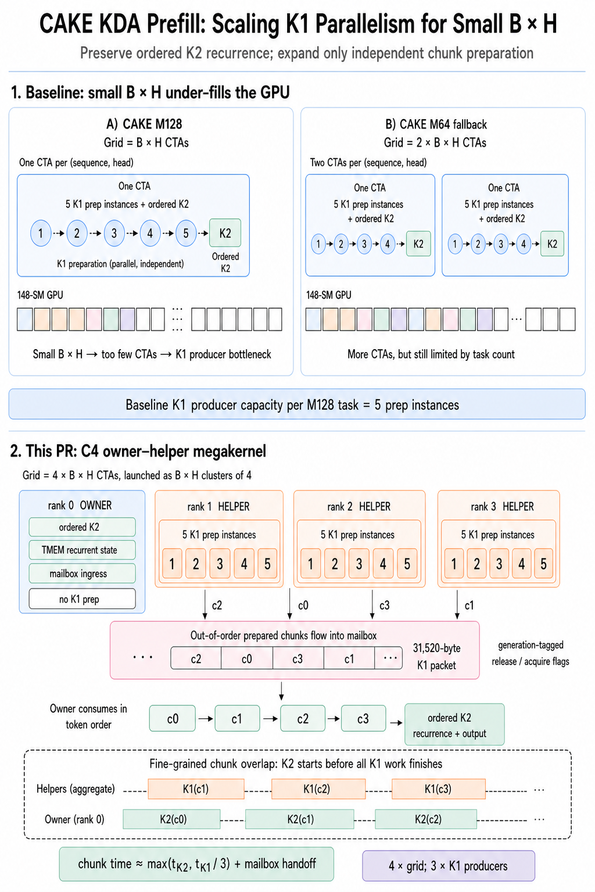
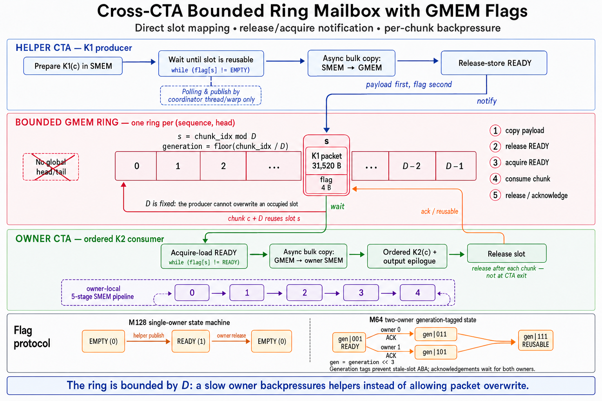

# CAKE KDA Prefill: Scaling K1 Parallelism for Small B x H

> Design note for the [small-BH K1-parallelism implementation branch](https://github.com/icavan/flashinfer/tree/kda/k1-parallelism), which improves CAKE KDA prefill utilization when the number of sequence-head tasks is too small to fill an SM100-family GPU.

## TL;DR

Small `B x H` leaves too few CAKE CTAs to fill an SM100-family GPU. The C4 path keeps ordered K2 recurrence and its TMEM-resident state on owner CTAs, while helper CTAs prepare independent K1 chunks and hand them over through a bounded, generation-tagged GMEM ring. M128 uses one owner plus three helpers; the specialized M64 route uses two owners plus two helpers. K1 preparation overlaps K2 chunk by chunk, and conservative dispatch preserves the original CAKE path as the fallback outside measured small-task regions.

## The bottleneck

CAKE fuses two logically different phases into one kernel:

- **K1** prepares independent 32-token chunks. It performs gate-prefix processing, Q/K transformations, chunk-local matrix products, and inverse preparation.
- **K2** consumes those prepared chunks in token order. It advances the recurrent state and produces the output while keeping the state resident in TMEM.

The baseline M128 kernel launches one CTA for each `(sequence, head)` task, so its grid contains `B x H` CTAs. Each CTA has five internal K1 preparation instances and one ordered K2 consumer. The M64 schedule can provide more CTA-level parallelism, but its baseline use is specialized and still ties available work to the number of logical tasks.

This arrangement is efficient when `B x H` is large. For small `B x H`, however, too few CTAs are available to occupy the GPU. Many SMs remain idle even though future K1 chunks are independent and could be prepared concurrently. K1 preparation therefore becomes the exposed producer bottleneck.

## Owner-helper decomposition

The new path expands each logical task into a four-CTA cluster, called **C4**.

For the illustrated M128 path:

- rank 0 is the **owner**;
- ranks 1 through 3 are **helpers**;
- the launch grid grows from `B x H` to `4 x B x H` CTAs;
- each helper retains five in-CTA preparation instances;
- the owner retains the ordered K2 recurrence and TMEM-resident state.

The three helpers therefore expose 15 K1 preparation instances per logical task instead of the five instances inside one baseline M128 CTA. The point is not to parallelize the recurrence. It is to move independent K1 work onto SMs that the small baseline grid would otherwise leave idle.

The specialized M64 C4 route uses the same principle with a different role split: two 64-row owners divide the K2/state work, while two helpers prepare K1 packets shared by those owners. This is useful for the very small fixed route currently selected for `B=1`, `H=1`, and long sequences on B200.

## Mailbox handoff and ordering

Helpers may finish chunks out of order. They publish prepared K1 packets to a bounded global-memory ring mailbox, with generation-tagged release and acknowledgement flags.

The protocol has three important properties:

1. A helper writes a complete packet before publishing its release generation.
2. The owner waits for the expected generation of the next token-order chunk.
3. After consumption, the owner publishes an acknowledgement before that ring slot can be reused.

Release/acquire ordering makes the packet visible before the ready flag is observed, while the generation tag prevents a stale ready state from being confused with a later reuse of the same slot. Only chunk-local prepared data crosses the mailbox; recurrent state remains private to the owner.

For M64, the two owners acknowledge independently. Starting from `gen | 001` (ready), owner 0 contributes the mask that produces `gen | 011`, while owner 1 contributes the mask that produces `gen | 101`. A slot becomes reusable only when both acknowledgements are present as `gen | 111`; `011` is therefore not an intermediate state that owner 1 directly transforms into `111`.

## Fine-grained K1-K2 overlap

This is still a fully fused owner-helper megakernel, not a batch-wide two-kernel K1/K2 split. The owner does not wait for every helper to finish all K1 work.

As soon as the packet for chunk `c0` is available, the owner starts `K2(c0)`. While that recurrence runs, helpers continue preparing `c1`, `c2`, and later chunks. The steady-state chunk time is therefore governed approximately by the slower of ordered K2 and aggregate helper K1 throughput, plus mailbox handoff overhead.

This fine-grained overlap is the central advantage of the design:

- K1 parallelism scales beyond the original `B x H` task count;
- K2 starts as soon as its next dependency is ready;
- K2 recurrence remains strictly ordered;
- recurrent state remains on chip in the owner;
- unsupported or unprofitable shapes use the original CAKE path unchanged.

## Conservative routing

Automatic dispatch enables C4 only in measured small-task regions. It keeps the existing CAKE M64 or M128 implementation as the exact fallback elsewhere. M128 C8 remains an explicitly forced validation path rather than an automatic route.

Packed variable-length inputs are also routed conservatively. The B200 decision uses host-known aggregate sequence information and does not copy device `cu_seqlens` to the CPU. B300 packed inputs and shapes outside the measured regions remain on the baseline path.

## B200 performance smoke results

The following cold-L2 CUDA-event measurements are the small-`B x H` smoke results reported with the implementation. They use source-built modules and two deterministically shuffled rounds, and validate both the output and final recurrent state before timing. Small-head rows use CAKE-M128 as the valid baseline because the original M64 baseline is specialized for the fixed `B=1`, `H=64` contract and is not a small-head oracle.

| B | T | H | Selected route | CAKE-M128 | Owner/helper | Speedup |
| ---: | ---: | ---: | --- | ---: | ---: | ---: |
| 1 | 2048 | 1 | M128 C4/D15 | 0.144480 ms | 0.119872 ms | 1.205x |
| 1 | 2048 | 4 | M128 C4/D15 | 0.144480 ms | 0.121888 ms | 1.185x |
| 1 | 2048 | 8 | M128 C4/D15 | 0.142048 ms | 0.119712 ms | 1.187x |
| 1 | 4096 | 1 | M64 C4/D10 | 0.269424 ms | 0.199120 ms | 1.353x |
| 1 | 4096 | 4 | M128 C4/D15 | 0.270496 ms | 0.216064 ms | 1.252x |
| 1 | 4096 | 8 | M128 C4/D15 | 0.267168 ms | 0.211008 ms | 1.266x |

## Takeaway

The optimization separates two dependency domains that were previously bound to the same CTA count: stateless K1 chunk preparation and stateful K2 recurrence. Helper CTAs scale the former across otherwise idle SMs, while owner CTAs preserve the latter's ordering and on-chip state. That makes small-`B x H` CAKE prefill better able to use the GPU without giving up the fully fused recurrent execution model.

## References

- [Small-BH K1-parallelism implementation branch](https://github.com/icavan/flashinfer/tree/kda/k1-parallelism)
- [CAKE KDA prefill baseline, PR #4262](https://github.com/flashinfer-ai/flashinfer/pull/4262)
