# MoonEP Public API Visual Guide

This guide explains the public Python interface exported by `moonep` and the
global-memory layouts used at each communication boundary. The diagrams are
derived from the implementation in `moonep/api.py` and `moonep/planning.py`.
Internal `_launch_*` helpers and Python dunder methods are intentionally out of
scope.

MoonEP exports two public types:

```python
from moonep import Buffer, MoonEPCommPlan
```

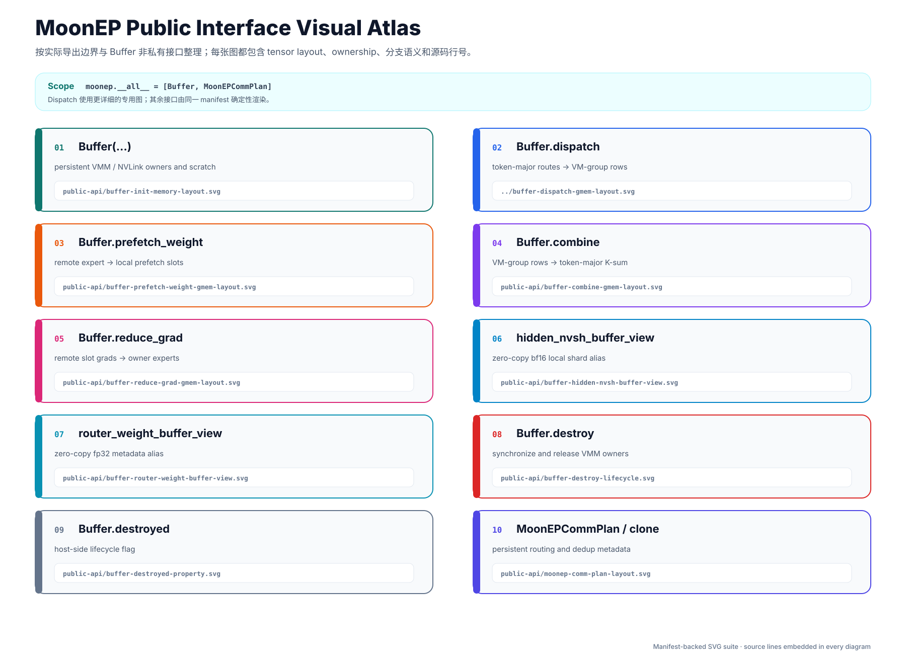

## Notation

| Symbol | Meaning |
| --- | --- |
| `S` | Input tokens per source rank |
| `H` | Hidden dimension |
| `K` | Top-k routes per token |
| `E` | Total experts in the expert-parallel group |
| `R` | Number of expert-parallel ranks |
| `B` | Remote-weight prefetch slots per rank |
| `H'` | Trailing expert-weight dimension |
| `N` | Route count on one source rank, `S * K` |
| `NvS` | Logical dispatched-row capacity on one rank |

`NvS` is a capacity, not necessarily the number of valid tokens. The valid and
padded spans of the physical expert groups are described by `cu_seqlens` and
the saved communication plan.

## `Buffer(...)`

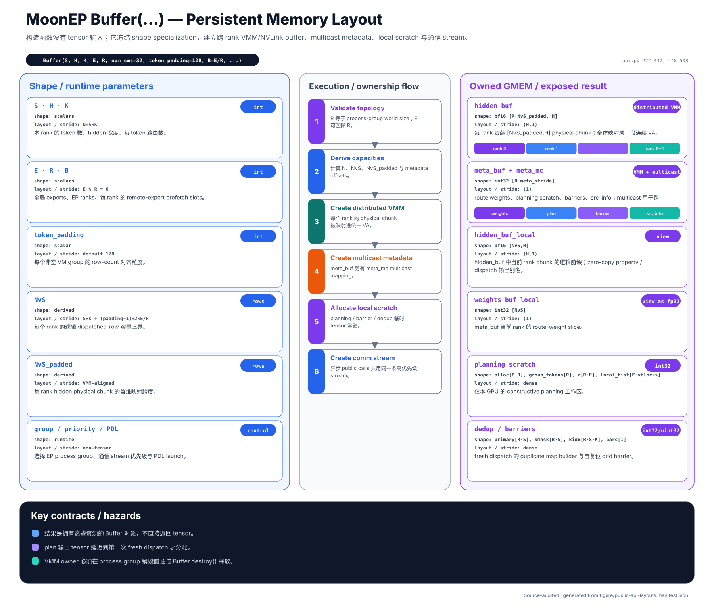

**Purpose.** `Buffer` owns the persistent resources shared by dispatch,
weight prefetch, combine, and gradient reduction: distributed VMM/NVLink
buffers, multicast metadata, local scratch tensors, and a high-priority CUDA
communication stream.

The constructor validates the EP topology (`E` must be divisible by `R`, and
`num_ep_ranks` must match the process-group size), derives the route and
padding capacities, creates the distributed hidden and metadata allocations,
and exposes rank-local views into those allocations. The hidden allocation is
logically `[R * NvS_padded, H]` in `bf16`; each rank works with its local
`[NvS, H]` window. Routing weights live in an `int32` metadata allocation and
are reinterpreted as `fp32` when exposed.

Important constructor controls include:

- `token_padding`: alignment, in rows, for each non-empty physical VM group.
- `B`: number of remote expert-weight slots per rank; the default is `E / R`.
- `num_sms`: communication-kernel SM budget; the default is 32.
- `comm_stream_priority`: priority of the private asynchronous stream.
- `enable_pdl`: enables CUDA Programmatic Dependent Launch for eligible
  same-stream kernel chains; disabling it preserves ordinary stream ordering.

Construction returns a resource-owning Python object rather than a tensor.
Create it only after the distributed process group has been initialized, and
destroy it before that process group is torn down.

## `Buffer.dispatch(...)`

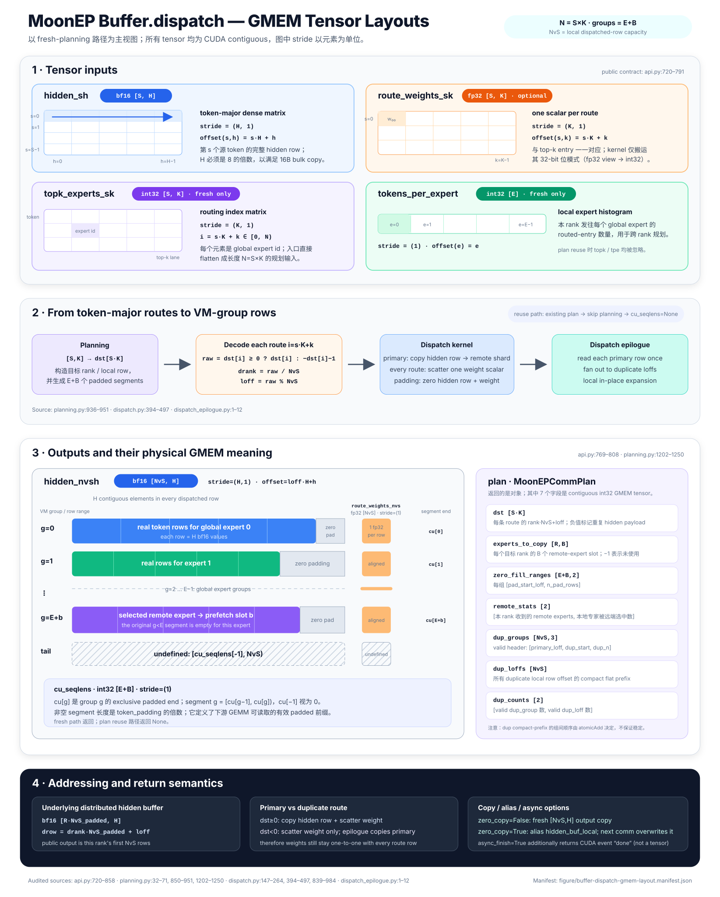

**Purpose.** Dispatch scatters token-major input into expert-grouped physical
VM rows, optionally carrying one routing weight for every route.

On a fresh call, the tensor contract is:

| Value | Layout | Type | Meaning |
| --- | --- | --- | --- |
| `hidden_sh` | `[S, H]` | `bf16` | Source tokens, contiguous by hidden row |
| `route_weights_sk` | `[S, K]` | `fp32` | Optional weight for every token route |
| `topk_experts_sk` | `[S, K]` | `int32` | Destination expert ID for every route |
| `tokens_per_expert` | `[E]` | `int32` | Source-rank histogram used by planning |
| `hidden_nvsh` | `[NvS, H]` | `bf16` | Dispatched rows in physical VM-group order |
| `route_weights_nvs` | `[NvS]` | `fp32` | Optional dispatched route weights |
| `cu_seqlens` | `[E+B]` | `int32` | Padded end offset of each physical VM group |

At a high level, planning converts the `S * K` logical routes into a compact
`dst` map, assigns local offsets, reserves `E+B` padded VM segments, and builds
duplicate-route metadata. Dispatch then decodes route `i = s * K + k`, copies
the primary hidden row to the destination rank, scatters every routing weight,
zero-fills padding, and expands locally deduplicated routes in an epilogue.

The return value is
`(hidden_nvsh, route_weights_nvs, cu_seqlens, plan)`. With
`async_finish=True`, a CUDA event is appended. When an existing `plan` is
passed, planning is skipped, `topk_experts_sk` and `tokens_per_expert` are
ignored, and `cu_seqlens` is `None`. This is the normal combine-backward path:
the token-major output gradient is dispatched again using the forward plan.

`zero_copy=True` returns the persistent hidden-buffer alias instead of copying
it into a new tensor. `router_weights_zero_copy=True` independently enables the
same behavior for routing weights. Both aliases are overwritten by later
communication calls and must not escape into autograd-saved state.

## `Buffer.prefetch_weight(...)`

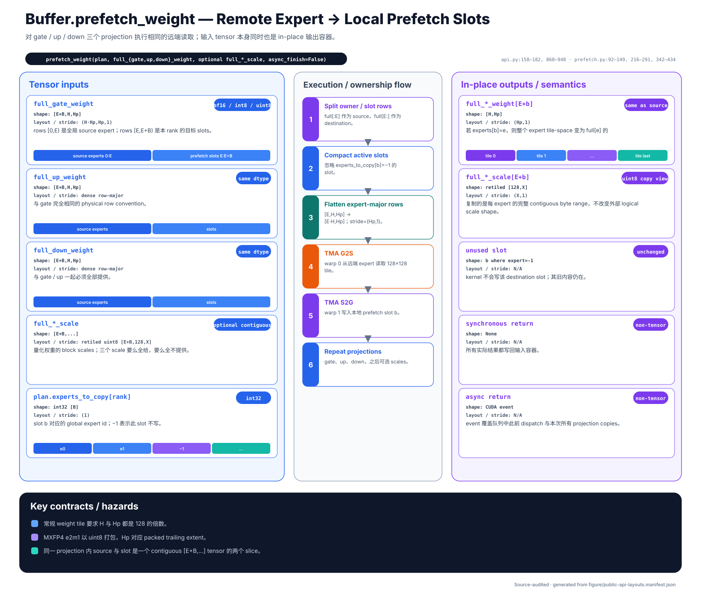

**Purpose.** Weight prefetch copies the remote expert weights selected by a
dispatch plan into the current rank's `B` local prefetch slots.

The gate, up, and down tensors use the same expert-major layout:
`[E+B, H, H']`. Rows `[0, E)` contain the authoritative expert weights; rows
`[E, E+B)` are temporary prefetch slots filled in place. Unquantized weights
are `bf16`; packed MXFP4 weights use `uint8`. Optional block-scale tensors use
the same leading `E+B` row convention and must be supplied as a complete
gate/up/down set.

`plan.experts_to_copy[rank]` maps each local slot to a global source expert;
`-1` means that the slot is unused. The implementation splits that expert ID
into its owning rank and rank-local expert row, flattens the expert-major
source into a tiled matrix, and performs remote TMA transfers into the slot.
The same operation is repeated for gate, up, and down weights and, when
present, their scales.

The tensors are mutated in place. Synchronous mode returns `None`; asynchronous
mode returns the communication-stream event. Because all asynchronous Buffer
operations use the same stream, calling this after asynchronous dispatch keeps
the required order, and the returned event covers both queued operations.

## `Buffer.combine(...)`

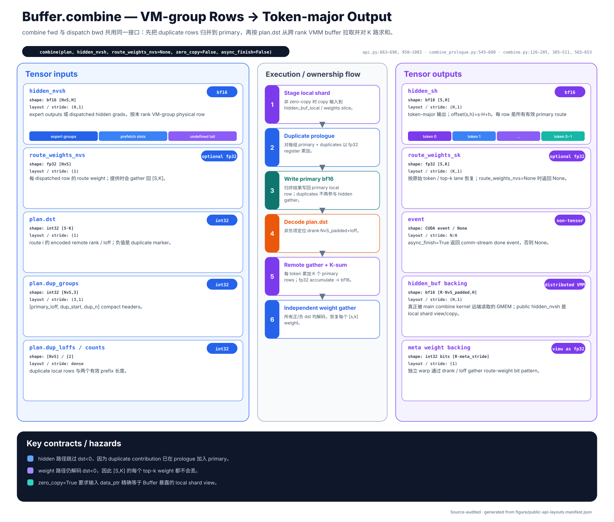

**Purpose.** Combine is the reverse data movement of dispatch: it gathers
expert-grouped rows and sums the `K` routed contributions back into token-major
`[S, H]`. The same primitive is used for dispatch backward.

Inputs are a saved plan, `hidden_nvsh [NvS, H] bf16`, and an optional
`route_weights_nvs [NvS] fp32`. Unless zero-copy is requested, MoonEP first
stages these inputs into the persistent local shard. A duplicate prologue
accumulates duplicate physical rows into their primary rows in `fp32`. The main
kernel then follows `plan.dst`, remotely reads valid rows, and performs the
top-k reduction for every original token. Routing weights are independently
gathered back through the same positive/negative destination encoding.

The result is `(hidden_sh, route_weights_sk, event)`, where `hidden_sh` is
`[S, H]`, the optional weights are `[S, K]`, and `event` is non-`None` only in
asynchronous mode.

With `zero_copy=True`, `hidden_nvsh` must be the exact persistent alias returned
by zero-copy dispatch; MoonEP checks pointer identity and skips the staging
copy. `router_weights_zero_copy` has the corresponding independent contract
for weights.

## `Buffer.reduce_grad(...)`

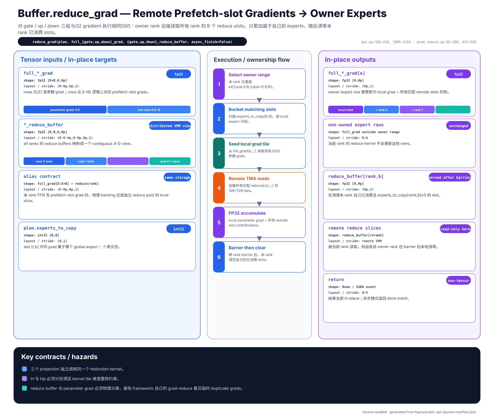

**Purpose.** Gradient reduction returns the gradients accumulated in remote
prefetch slots to the home expert and adds them to the authoritative local
expert gradient.

The three full gradient tensors use `[E+B, H, H'] fp32`; their expert rows are
`[0, E)` and their temporary slot rows are `[E, E+B)`. The matching reduce
buffers expose all ranks as `[R, B, H, H'] fp32`. Keeping slot gradients in a
separate distributed reduce pool prevents temporary duplicate-expert rows from
being mistaken for ordinary framework-owned expert parameters.

For each locally owned expert, the kernel finds matching entries in
`plan.experts_to_copy`, seeds the accumulator with the local authoritative
gradient, remotely reads matching slot gradients from every rank, and writes
the sum back to the expert row. After the communication barrier, the consumed
local slots are cleared for the next microbatch. Gate, up, and down tensors are
processed together.

This API mutates its tensors in place. It returns `None` synchronously or a CUDA
event asynchronously.

## `Buffer.hidden_nvsh_buffer_view`

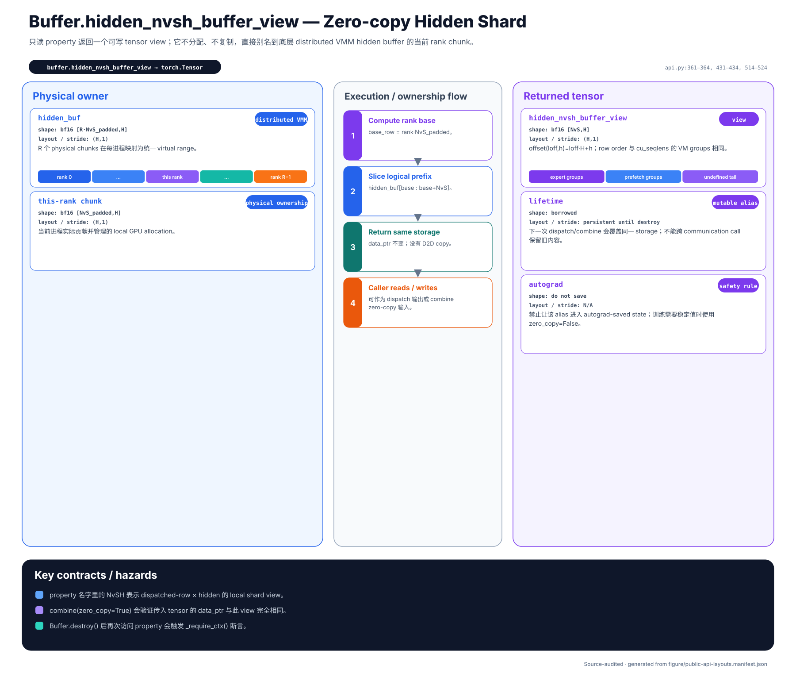

**Purpose.** This property exposes the current rank's writable `[NvS, H] bf16`
slice of the persistent NVLink hidden buffer.

It performs no allocation and no copy: the returned tensor is an alias whose
first physical row starts at the rank's `rank * NvS_padded` base. It is useful
when an expert FFN can write its result directly into the communication shard
and then call `combine(zero_copy=True)`. The storage is reused by future
dispatch/combine calls, so neither this view nor another tensor sharing its
storage may be retained by autograd.

## `Buffer.router_weight_buffer_view`

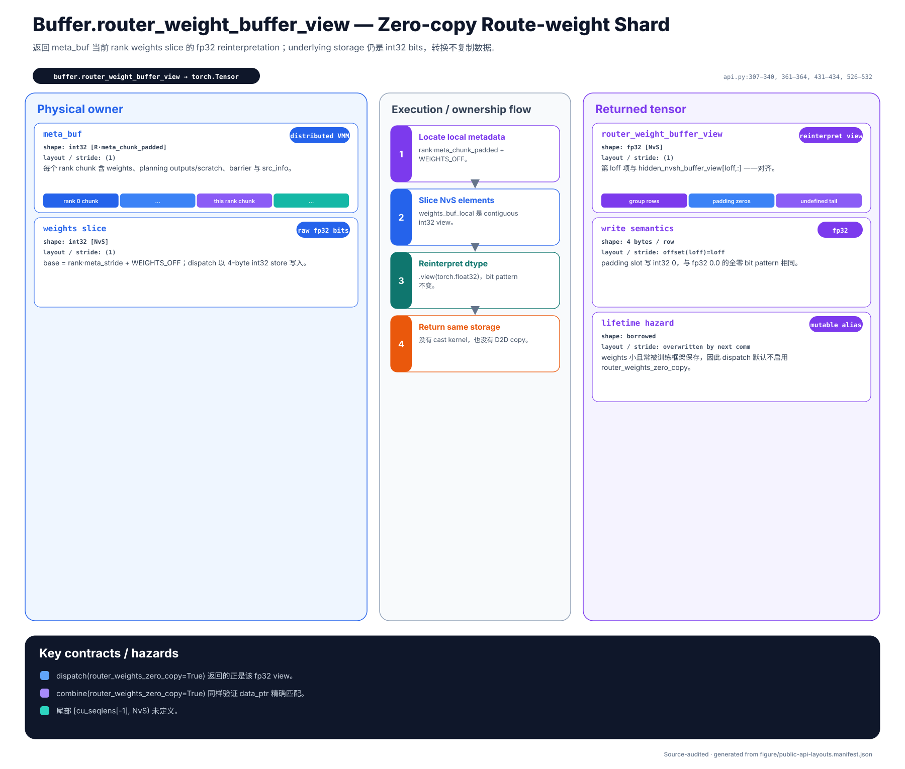

**Purpose.** This property exposes the current rank's routing-weight slice as a
writable `[NvS] fp32` zero-copy alias.

The underlying metadata allocation is `int32`; `.view(torch.float32)` changes
only the interpretation of the bits. It is not a numeric conversion and does
not allocate storage. Routing weights are especially likely to be saved by
training frameworks, which is why dispatch keeps their zero-copy behavior as a
separate, explicit opt-in.

## `Buffer.destroy()`

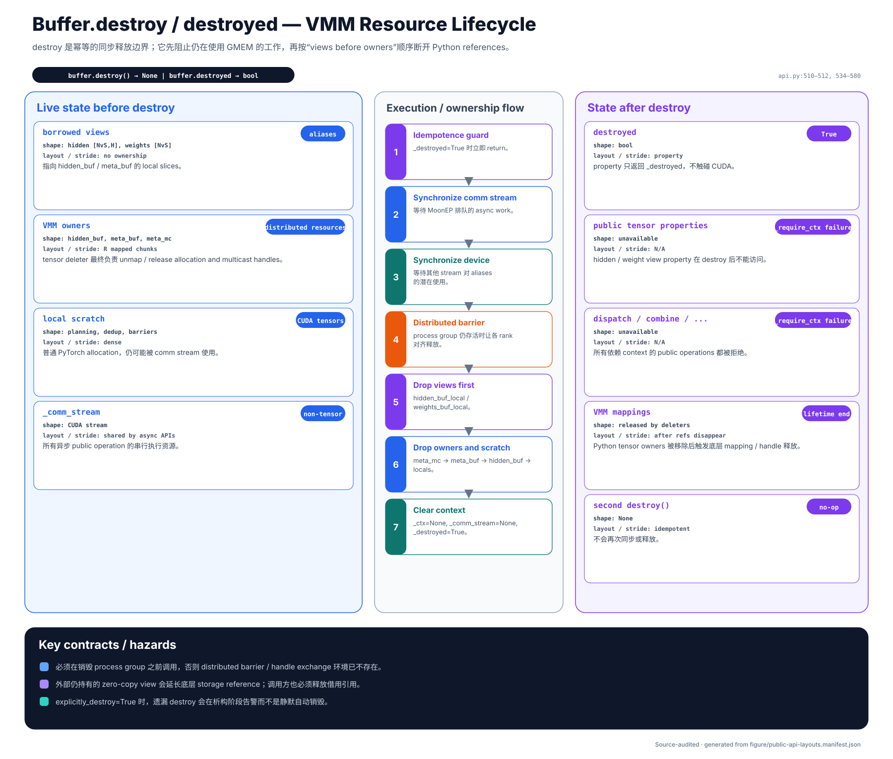

**Purpose.** `destroy()` synchronizes outstanding work and releases every VMM,
NVLink, multicast, scratch, and stream resource owned by the Buffer.

The lifecycle is deliberately ordered: synchronize the private communication
stream, synchronize the CUDA device, execute a process-group barrier, drop
rank-local and multicast views before their owning allocations, clear the
context, and mark the Buffer destroyed. The method is idempotent.

Call it on every participating rank before `torch.distributed` tears down the
process group. `explicitly_destroy=True` changes forgotten cleanup into a
warning rather than silently attempting destruction from the Python finalizer.

## `Buffer.destroyed`

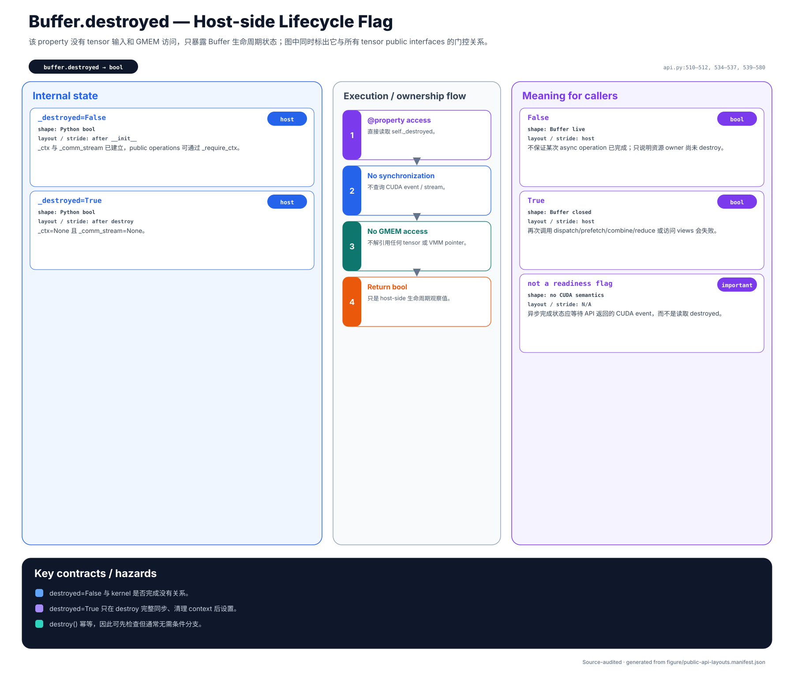

**Purpose.** This read-only host Boolean reports whether `destroy()` has
completed for the object.

It is a lifecycle flag, not a CUDA-completion signal. For asynchronous
dispatch, prefetch, combine, or reduction, wait on the event returned by that
operation when downstream stream ordering is required.

## `MoonEPCommPlan` and `MoonEPCommPlan.clone()`

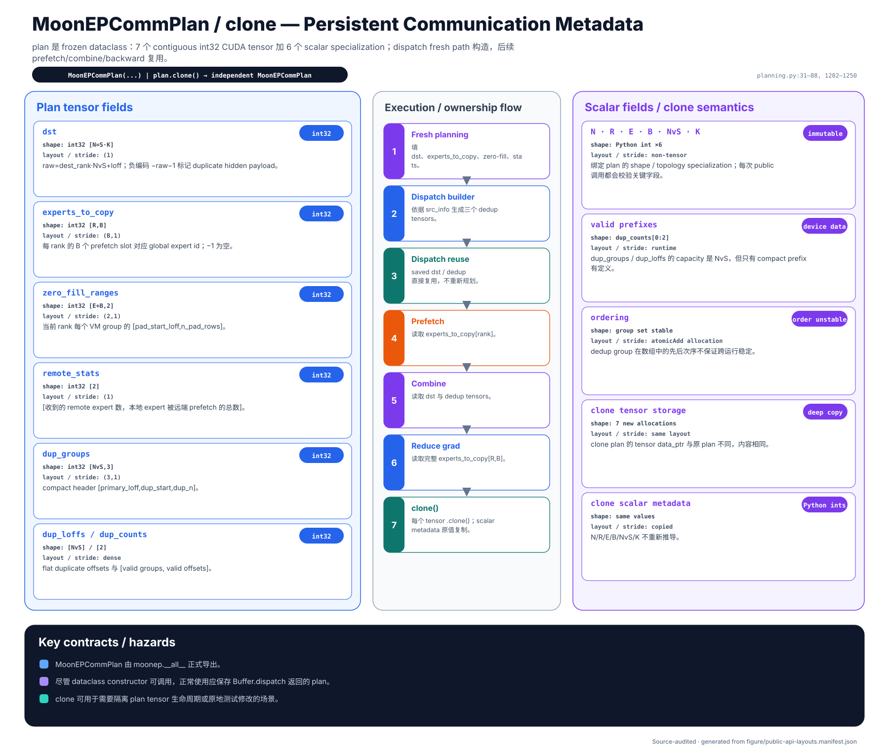

**Purpose.** `MoonEPCommPlan` is the reusable route map created by fresh
dispatch and consumed by prefetch, combine, reduction, and the backward paths.

Its seven contiguous `int32` tensors are:

| Field | Shape | Role |
| --- | --- | --- |
| `dst` | `[S*K]` | Encoded physical destination of every logical route |
| `experts_to_copy` | `[R, B]` | Remote expert assigned to every prefetch slot |
| `zero_fill_ranges` | `[E+B, 2]` | Padding range for every physical VM group |
| `remote_stats` | `[2]` | Compact cross-rank planning statistics |
| `dup_groups` | `[NvS, 3]` | Primary-row and compact duplicate-group records |
| `dup_loffs` | `[NvS]` | Compact duplicate local offsets |
| `dup_counts` | `[2]` | Valid prefix sizes for the duplicate arrays |

The scalar fields `N`, `R`, `E`, `B`, `NvS`, and `K` bind those tensors to the
Buffer configuration. Duplicate-array ordering comes from atomic construction
and is not guaranteed to be stable.

Normal callers obtain a plan from `dispatch` rather than constructing one
manually. `clone()` deep-copies all seven CUDA tensors and copies the scalar
values, producing a plan whose mutable storage is independent of the original.

## Typical forward and backward sequence

```python
# Forward communication
hidden_nvsh, weights_nvs, cu_seqlens, plan, dispatch_done = buffer.dispatch(
    hidden_sh,
    route_weights_sk,
    topk_experts_sk,
    tokens_per_expert,
    async_finish=True,
)
prefetch_done = buffer.prefetch_weight(
    plan,
    async_finish=True,
    full_gate_weight=full_gate_weight,
    full_up_weight=full_up_weight,
    full_down_weight=full_down_weight,
)

# Expert computation consumes hidden_nvsh and the expert/prefetch rows.
hidden_sh, weights_sk, combine_done = buffer.combine(
    plan,
    expert_output_nvsh,
    weights_nvs,
    async_finish=True,
)

# Backward communication reuses the forward plan.
grad_nvsh, _, _, _, dispatch_bwd_done = buffer.dispatch(
    grad_output_sh,
    plan=plan,
    async_finish=True,
)
reduce_done = buffer.reduce_grad(
    plan,
    async_finish=True,
    full_gate_grad=full_gate_grad,
    full_up_grad=full_up_grad,
    full_down_grad=full_down_grad,
    gate_reduce_buffer=gate_reduce_buffer,
    up_reduce_buffer=up_reduce_buffer,
    down_reduce_buffer=down_reduce_buffer,
)

buffer.destroy()
```

The snippet emphasizes API order rather than synchronization details. Waiting
on the final event of a same-stream chain is sufficient to cover earlier work
queued on that Buffer's communication stream.

## Source basis

The diagrams and descriptions were audited against MoonEP commit
[`2bd860b`](https://github.com/MoonshotAI/MoonEP/tree/2bd860b4dd083df62b79d5e916fca71ec5742228),
primarily
[`moonep/api.py`](https://github.com/MoonshotAI/MoonEP/blob/2bd860b4dd083df62b79d5e916fca71ec5742228/moonep/api.py)
and
[`moonep/planning.py`](https://github.com/MoonshotAI/MoonEP/blob/2bd860b4dd083df62b79d5e916fca71ec5742228/moonep/planning.py).
If behavior and diagrams diverge, the implementation is the source of truth.
