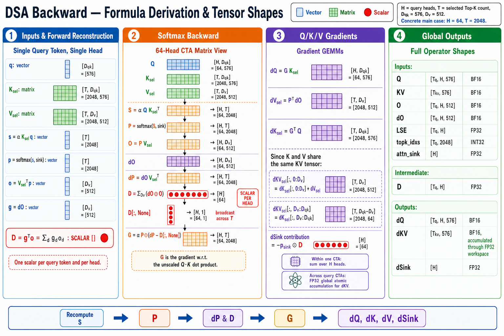
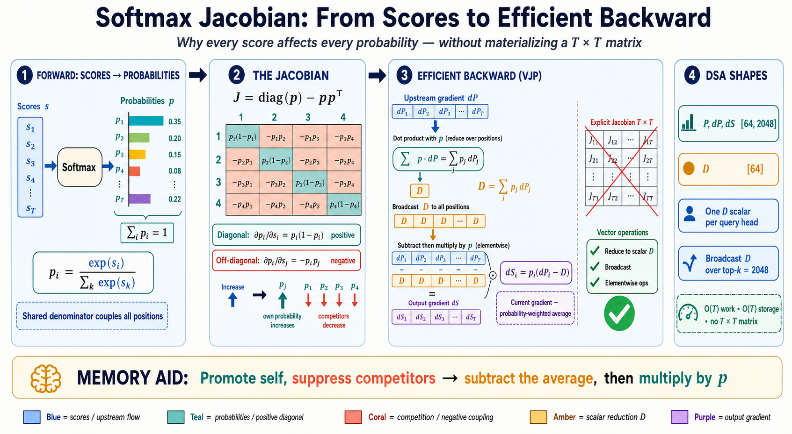

# DeepSeek Sparse Attention Forward and Backward: Formula Derivation and Tensor Shapes

This note derives the forward and backward equations used by the shared-KV,
top-k sparse attention operator discussed in the TileLang and cuDNN DSA
implementations. Every symbol is annotated with its shape, first for one query
token and one query head, and then in the matrix form used by a 64-head CTA.

The concrete configuration used throughout the implementation discussion is:

| Symbol | Meaning | Concrete value |
| --- | --- | ---: |
| `H` | Number of query heads | 64 |
| `T` | Selected KV rows per query token, or top-k | 2,048 |
| `Dqk` | Query/key width | 576 |
| `Dv` | Value/output width | 512 |
| `BK` | KV rows processed by one inner-loop tile | 64 |

[](pictures/dsa-backward-formula-derivation-and-tensor-shapes.png)

## 1. Operator-level inputs and outputs

Let `Tq` be the total number of packed query tokens and `Tkv` the total number
of packed KV tokens. A representative shared-KV DSA interface has the following
logical tensors:

| Tensor | Shape | Typical storage type | Role |
| --- | --- | --- | --- |
| `Q` | `[Tq, H, Dqk]` | BF16 or FP16 | Query vectors |
| `KV` | `[Tkv, Dqk]` | BF16 or FP16 | Shared key/value rows |
| `topk_idxs` | `[Tq, T]` | INT32 | Selected global KV row indices for each query token |
| `topk_length` | `[Tq]` | INT32 | Optional valid selection count when rows are padded |
| `attn_sink` | `[H]` | FP32 | Optional learned sink logit, one scalar per query head |
| `O` | `[Tq, H, Dv]` | BF16 or FP16 | Saved forward output |
| `LSE` | `[Tq, H]` | FP32 | Saved log-sum-exp normalizer |
| `dO` | `[Tq, H, Dv]` | BF16 or FP16 | Upstream gradient |

The backward operator produces:

| Tensor | Shape | Typical storage type | Role |
| --- | --- | --- | --- |
| `dQ` | `[Tq, H, Dqk]` | BF16 or FP16 | Query gradient |
| `dKV` | `[Tkv, Dqk]` | BF16 or FP16 | Gradient of the tied KV tensor |
| `dSink` | `[H]` | FP32 | Optional attention-sink gradient |

For the tied `KV` layout, the full 576-wide row acts as the key, while its
first 512 components also act as the value:

```math
K = KV[:, 0:D_{qk}] \in \mathbb{R}^{T_{kv}\times D_{qk}},
\qquad
V = KV[:, 0:D_v] \in \mathbb{R}^{T_{kv}\times D_v}.
```

Consequently, the first 512 components of `dKV` receive both key-gradient and
value-gradient contributions. The final 64 components receive only the key
gradient.

`topk_idxs` is shared by all `H` query heads belonging to the same query token.
It identifies individual KV tokens, not entire sequences. In a packed THD
layout, those indices may already be global packed-row indices, so the sparse
attention core does not inherently need `cu_seqlens`; sequence boundaries must
already have been respected when the index list was constructed.

## 2. One query token and one head

Fix one query token `i` and one query head `h`. To keep the matrix orientation
unambiguous, vectors in this section are column vectors.

| Symbol | Shape | Meaning |
| --- | --- | --- |
| `q` | `[Dqk]` | Query vector `Q[i, h, :]` |
| `I` | `[T]` | Selected indices `topk_idxs[i, :]` |
| `Ksel` | `[T, Dqk]` | Selected key rows `K[I, :]` |
| `Vsel` | `[T, Dv]` | Selected value rows `V[I, :]` |
| `s` | `[T]` | Scaled attention logits |
| `p` | `[T]` | Probabilities assigned to selected KV rows |
| `p_sink` | scalar | Probability assigned to the optional sink |
| `o` | `[Dv]` | Forward output vector |
| `g` | `[Dv]` | Upstream gradient `dO[i, h, :]` |
| `D` | scalar | Dot product of `g` and `o` |

### 2.1 Forward scores

Let `alpha` be the attention scale, normally related to the inverse square root
of the query/key width. The selected KV scores are:

```math
s = \alpha K_{sel}q
\in \mathbb{R}^{T}.
```

Equivalently, one selected row produces one scalar:

```math
s_t = \alpha k_t^{\mathsf T}q,
\qquad t \in \{1,\ldots,T\}.
```

### 2.2 Softmax with an optional attention sink

Let `z` be the scalar sink logit for head `h`. The denominator includes both
the selected KV logits and the sink:

```math
Z = \exp(z) + \sum_{u=1}^{T}\exp(s_u)
\in \mathbb{R}.
```

The probabilities are:

```math
p_t = \frac{\exp(s_t)}{Z},
\qquad
p_{sink} = \frac{\exp(z)}{Z}.
```

Therefore:

```math
\sum_{t=1}^{T}p_t + p_{sink} = 1.
```

The sink has no value vector in this formulation. It absorbs probability mass
but contributes a zero vector to the output. The forward output is therefore:

```math
o = V_{sel}^{\mathsf T}p
  = \sum_{t=1}^{T}p_tv_t
\in \mathbb{R}^{D_v}.
```

If attention sink is disabled, take `z` to negative infinity. Then `p_sink` is
zero and the equations reduce to ordinary softmax over the selected KV rows.

## 3. Backward derivation, one step at a time

Assume the scalar loss is `L`, and let:

```math
g = \frac{\partial L}{\partial o}
\in \mathbb{R}^{D_v}.
```

### 3.1 Gradient with respect to each probability

Because the output is a weighted sum of value vectors, changing one scalar
probability `p_t` changes `o` in the direction of `v_t`:

```math
\frac{\partial o}{\partial p_t}=v_t
\in \mathbb{R}^{D_v}.
```

Applying the chain rule gives one scalar per selected KV row:

```math
dP_t
= \frac{\partial L}{\partial p_t}
= g^{\mathsf T}v_t
\in \mathbb{R}.
```

Stacking all rows gives:

```math
dP = V_{sel}g
\in \mathbb{R}^{T}.
```

### 3.2 Why `D = dO dot O` is a scalar

Both `g`, which is `dO` for this token and head, and `o` are vectors of length
`Dv`. Their dot product reduces the value-feature dimension:

```math
D = g^{\mathsf T}o
  = \sum_{j=1}^{D_v}g_jo_j
\in \mathbb{R}.
```

Using the forward equation, this scalar can also be written as:

```math
D
= g^{\mathsf T}\left(\sum_{u=1}^{T}p_uv_u\right)
= \sum_{u=1}^{T}p_u\left(g^{\mathsf T}v_u\right)
= \sum_{u=1}^{T}p_udP_u.
```

Thus, `D` is scalar for one query token and one head. Across the full operator,
there is one such scalar per token-head pair, so the full `D` tensor has shape
`[Tq, H]`.

### 3.3 Gradient through softmax

[](pictures/softmax-jacobian-from-scores-to-efficient-backward.png)

The softmax Jacobian for a selected score is:

```math
\frac{\partial p_u}{\partial s_t}
= p_u\left(\delta_{ut}-p_t\right).
```

Applying the chain rule and collecting terms:

```math
\begin{aligned}
\frac{\partial L}{\partial s_t}
&= \sum_{u=1}^{T}
   \frac{\partial L}{\partial p_u}
   \frac{\partial p_u}{\partial s_t} \\
&= \sum_{u=1}^{T}dP_u p_u(\delta_{ut}-p_t) \\
&= p_tdP_t-p_t\sum_{u=1}^{T}p_udP_u \\
&= p_t(dP_t-D).
\end{aligned}
```

Define the gradient of the scaled score as `dS`:

```math
dS = p\odot(dP-D\mathbf{1}_T)
\in \mathbb{R}^{T}.
```

The same scalar `D` is broadcast across all `T` selected positions. Many GPU
kernels instead define `G` as the gradient with respect to the unscaled dot
product, folding the scale into this stage:

```math
G = \alpha dS
  = \alpha p\odot(dP-D\mathbf{1}_T)
\in \mathbb{R}^{T}.
```

### 3.4 Query, key, and value gradients

The query gradient is a weighted sum of selected key rows:

```math
dq = K_{sel}^{\mathsf T}G
\in \mathbb{R}^{D_{qk}}.
```

The selected key gradient is an outer product:

```math
dK_{sel}=Gq^{\mathsf T}
\in \mathbb{R}^{T\times D_{qk}}.
```

The selected value gradient is also an outer product:

```math
dV_{sel}=pg^{\mathsf T}
\in \mathbb{R}^{T\times D_v}.
```

For the tied KV row layout, these contributions merge as follows:

```math
\begin{aligned}
dKV_{sel}[:,0:D_v]
  &= dK_{sel}[:,0:D_v] + dV_{sel}, \\
dKV_{sel}[:,D_v:D_{qk}]
  &= dK_{sel}[:,D_v:D_{qk}].
\end{aligned}
```

The same KV row can be selected by many query tokens, so all of those
contributions must be reduced into the corresponding global `dKV` row.

### 3.5 Attention-sink gradient

The sink contributes zero to `o`, so its probability-gradient is zero. Its
logit-gradient still receives the negative softmax coupling term:

```math
\frac{\partial L}{\partial z}
= p_{sink}(0-D)
= -p_{sink}D
\in \mathbb{R}.
```

The final `dSink[h]` is the sum of this scalar over all query tokens belonging
to head `h`.

## 4. A tiny numerical example

Use a one-dimensional value space with two selected KV rows and one sink:

```math
p_1=0.5,
\qquad
p_2=0.3,
\qquad
p_{sink}=0.2,
\qquad
v_1=2,
\qquad
v_2=-1,
\qquad
g=1.
```

The output and the scalar reduction are:

```math
o=0.5(2)+0.3(-1)=0.7,
\qquad
D=g\,o=1(0.7)=0.7.
```

The probability-gradients are `dP_1 = 2` and `dP_2 = -1`. Therefore:

```math
\begin{aligned}
dS_1 &= 0.5(2-0.7)=0.65, \\
dS_2 &= 0.3(-1-0.7)=-0.51, \\
dz   &= -0.2(0.7)=-0.14.
\end{aligned}
```

The three logit-gradients sum to zero, as required by softmax shift
invariance:

```math
0.65-0.51-0.14=0.
```

This example makes the role of `D` concrete: it is the common scalar correction
subtracted from every selected probability-gradient before multiplication by
that position's probability.

## 5. Matrix form for one query token and all 64 heads

The GPU kernel can process all heads for one query token together. For a fixed
query token `i`, use the following matrices:

| Tensor | Concrete shape | Meaning |
| --- | --- | --- |
| `Qi` | `[64, 576]` | Queries for all heads |
| `Ksel` | `[2048, 576]` | Selected keys shared by all heads |
| `Vsel` | `[2048, 512]` | Selected values shared by all heads |
| `S`, `P`, `dP`, `G` | `[64, 2048]` | Per-head, per-selected-row intermediates |
| `Oi`, `dOi` | `[64, 512]` | Output and upstream gradient |
| `D` | `[64]` | One reduction scalar per head |
| `dQi` | `[64, 576]` | Query gradient |
| `dKsel` | `[2048, 576]` | Key-gradient contribution from this query token |
| `dVsel` | `[2048, 512]` | Value-gradient contribution from this query token |

The forward equations become:

```math
S = \alpha Q_iK_{sel}^{\mathsf T}
\in \mathbb{R}^{64\times 2048},
```

```math
P = \mathrm{softmax}_{KV+sink}(S)
\in \mathbb{R}^{64\times 2048},
```

```math
O_i = PV_{sel}
\in \mathbb{R}^{64\times 512}.
```

The backward equations become:

```math
dP = dO_iV_{sel}^{\mathsf T}
\in \mathbb{R}^{64\times 2048},
```

```math
D = \mathrm{reduce\_sum}_{D_v}(dO_i\odot O_i)
\in \mathbb{R}^{64},
```

```math
G = \alpha P\odot\left(dP-D[:,\mathrm{None}]\right)
\in \mathbb{R}^{64\times 2048},
```

```math
dQ_i = GK_{sel}
\in \mathbb{R}^{64\times 576},
```

```math
dK_{sel}=G^{\mathsf T}Q_i
\in \mathbb{R}^{2048\times 576},
```

```math
dV_{sel}=P^{\mathsf T}dO_i
\in \mathbb{R}^{2048\times 512}.
```

This matrix view exposes the four major matrix multiplications in backward:
`dP`, `dQ`, `dK`, and `dV`.

## 6. Tiled GPU execution and intermediate shapes

With `T = 2048` and `BK = 64`, one query CTA walks over 32 selected-KV tiles:

```math
N_{tiles}=\frac{T}{BK}=\frac{2048}{64}=32.
```

For one 64-row KV tile, the important logical shapes are:

| Tile | Shape | Typical role |
| --- | --- | --- |
| `Q` | `[64, 576]` | Reused across all 32 KV tiles |
| `dO` | `[64, 512]` | Reused across all 32 KV tiles |
| `Ktile` | `[64, 576]` | Gathered selected key rows |
| `Vtile` | `[64, 512]` | Prefix of `Ktile` in the tied layout |
| `Stile` | `[64, 64]` | Score fragment |
| `Ptile` | `[64, 64]` | Recomputed probability fragment |
| `dPtile` | `[64, 64]` | Probability-gradient fragment |
| `Gtile` | `[64, 64]` | Scaled score-gradient fragment |
| `dQ contribution` | `[64, 576]` | Accumulated over the 32 tiles |
| `dKV tile` | `[64, 576]` | Reduced across 64 heads, then scattered |

A high-level pipeline is:

1. Load or gather `Ktile` and its 512-wide value prefix into shared memory.
2. Compute `Stile = alpha * Q * Ktile transpose` with tensor-core MMA.
3. Reconstruct `Ptile` from `Stile` and the saved normalization state.
4. Compute `dPtile = dO * Vtile transpose`.
5. Form `Gtile = alpha * Ptile * (dPtile - D[:, None])` elementwise.
6. Accumulate `dQ += Gtile * Ktile`.
7. Compute `dKtile = Gtile transpose * Q` and
   `dVtile = Ptile transpose * dO`.
8. Merge `dKtile` and `dVtile` into the tied 576-wide `dKV` contribution.
9. Scatter-add the contribution to the global FP32 `dKV` accumulation buffer.

The exact physical ownership of fragments between registers, shared memory,
and tensor memory depends on the kernel and architecture. The shapes above are
logical matrix shapes; a warpgroup MMA instruction stores only distributed
fragments of them in each thread or in tensor memory.

## 7. Saved LSE conventions and probability reconstruction

Saving the full probability tensor would require `[Tq, H, T]` elements. At
top-k 2,048 this is much larger than saving one FP32 normalizer per token and
head. Backward therefore normally recomputes scores and reconstructs
probabilities from the saved LSE.

Two LSE conventions must be distinguished.

### 7.1 Sink-inclusive LSE

If forward saves the complete natural-log denominator:

```math
LSE_{total}
= \ln\left(\exp(z)+\sum_{t=1}^{T}\exp(s_t)\right)
= \ln Z,
```

then:

```math
p_t=\exp(s_t-LSE_{total}),
\qquad
p_{sink}=\exp(z-LSE_{total}).
```

### 7.2 KV-only LSE

Some forward interfaces, including a FlashMLA-style sparse forward contract,
may return an LSE over selected KV logits only:

```math
LSE_{kv}=\ln\left(\sum_{t=1}^{T}\exp(s_t)\right).
```

When a sink is enabled, backward first combines it with the sink logit:

```math
LSE_{total}=\mathrm{logaddexp}(LSE_{kv},z).
```

The rest of backward must use `LSE_total`. Confusing KV-only and sink-inclusive
LSE changes every reconstructed probability and is therefore a correctness
error, not merely a performance detail.

### 7.3 Base-2 implementation form

GPU exponential instructions often use base 2. A preprocessing kernel can
store:

```math
scaled\_LSE=-\log_2 Z,
\qquad
sum\_OdO=-D.
```

Then the main kernel reconstructs probabilities and the centered derivative as:

```math
P
=2^{\alpha\log_2(e)(QK^{\mathsf T})+scaled\_LSE},
```

```math
dP+sum\_OdO=dP-D.
```

The signs may look unusual, but this representation removes two subtractions
from the hot loop while preserving the same mathematical result.

## 8. End-to-end forward and backward data flow

### Forward

1. `Q`, `KV`, and `topk_idxs` select and score `T` KV rows per query token.
2. The per-head sink logit is optionally included in the softmax denominator.
3. The selected values are reduced into `O [Tq, H, Dv]`.
4. Forward saves `LSE [Tq, H]`, either KV-only or sink-inclusive according to
   the interface contract.

### Backward prepass

1. Read `O [Tq, H, Dv]` and `dO [Tq, H, Dv]`.
2. Reduce the `Dv` dimension to compute `D [Tq, H]`.
3. Normalize the LSE convention and optionally prepare `scaled_LSE [Tq, H]`.

### Main sparse backward

1. Gather selected KV tiles using `topk_idxs [Tq, T]`.
2. Recompute scores and probabilities instead of loading a saved probability
   tensor.
3. Compute `dP`, `G`, and the matrix products for `dQ`, `dK`, and `dV`.
4. Write one private `dQ` result for the current query token.
5. Merge tied key/value gradients and atomically accumulate them into an FP32
   global `dKV` workspace because different query CTAs can update the same KV
   rows.
6. Accumulate `dSink [H]` if sink training is enabled.

### Finalization

1. Convert the FP32 `dKV` workspace to the requested BF16 or FP16 output type.
2. Return `dQ`, `dKV`, and optionally `dSink`.

## 9. Precision and determinism

A performance-oriented implementation can preserve the intended numerical
contract with the following policy:

| Stage | Recommended accumulation or compute type |
| --- | --- |
| Input `Q`, `KV`, `O`, `dO` | BF16 or FP16 storage |
| Score and `dP` MMA accumulation | FP32 |
| LSE, exponentials, `D`, and sink arithmetic | FP32 |
| Probability and score-gradient operands fed to MMA | BF16 or FP16 as required by the MMA path |
| `dQ`, `dK`, and `dV` MMA accumulation | FP32 |
| Cross-CTA `dKV` workspace and atomic reduction | FP32 |
| Final `dQ` and `dKV` output | Cast to the interface type |

The global FP32 atomic reduction makes `dKV` mathematically well defined but
not generally bitwise deterministic: the order in which query CTAs reach the
same KV row can change, and FP32 addition is not associative. This can produce
small run-to-run bit differences without changing the formula or storage
precision. A deterministic implementation would need a fixed reduction order,
usually at the cost of extra workspace, an additional reduction pass, or lower
parallelism.

## 10. Compact shape checklist

For the concrete `H = 64`, `T = 2048`, `Dqk = 576`, `Dv = 512` case:

| Quantity | One token, one head | One token, all heads | Whole packed problem |
| --- | --- | --- | --- |
| Query | `[576]` | `[64, 576]` | `[Tq, 64, 576]` |
| Selected key | `[2048, 576]` | Shared `[2048, 576]` | Source `[Tkv, 576]` |
| Selected value | `[2048, 512]` | Shared `[2048, 512]` | Prefix of source KV |
| Scores/probabilities | `[2048]` | `[64, 2048]` | Recomputed, not saved |
| Output/upstream gradient | `[512]` | `[64, 512]` | `[Tq, 64, 512]` |
| `D = dO dot O` | scalar | `[64]` | `[Tq, 64]` |
| Query gradient | `[576]` | `[64, 576]` | `[Tq, 64, 576]` |
| Selected KV contribution | `[2048, 576]` | Reduced `[2048, 576]` | Accumulated into `[Tkv, 576]` |
| Sink gradient | scalar | `[64]` before token reduction | `[64]` after reduction |

The central shape fact is simple: `O` and `dO` are vectors for one token-head
pair, so their dot product is a scalar. That scalar becomes `[Tq, H]` only after
stacking all query tokens and heads, and it is broadcast over the top-k axis
when forming the softmax score gradient.
