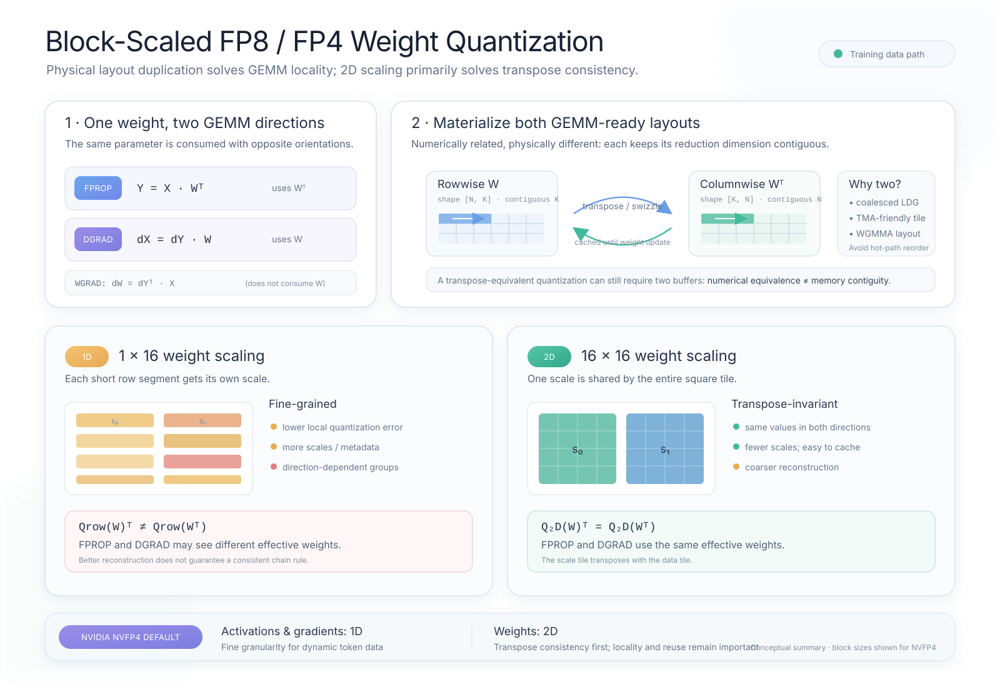

# Block-Scaled FP8 and FP4 Weight Quantization

## Physical Layout, Transpose Consistency, and the 1D-vs-2D Trade-off

Low-precision training uses the same weight matrix in two different GEMM orientations. This creates two related but distinct engineering problems:

1. The GPU needs an efficient physical layout for each GEMM direction.
2. The quantization recipe should decide whether the two directions represent the same effective low-precision weight.

These problems are easy to conflate. Storing both a quantized weight and a contiguous transpose is primarily a layout and data-movement decision. Choosing 1D or 2D block scaling is primarily a numerical decision, although it also affects metadata, conversion cost, and caching.



---

## 1. One parameter, two GEMM directions

Consider a linear layer with activation matrix $X$ and weight matrix $W$:

```math
Y = XW^T,
```

where $X$ has shape $[M,K]$ and $W$ has shape $[N,K]$.

The forward and backward passes contain three GEMMs:

```math
\begin{aligned}
\mathrm{FPROP}:\quad &Y = XW^T, \\
\mathrm{DGRAD}:\quad &dX = dY W, \\
\mathrm{WGRAD}:\quad &dW = dY^T X.
\end{aligned}
```

FPROP consumes $W^T$, while DGRAD consumes $W$. WGRAD does not consume the weight, but it introduces the same orientation problem for its activation and output-gradient operands.

This means that an efficient training implementation must support both rowwise and columnwise access to the weight. In Transformer Engine terminology, a quantized tensor may therefore contain:

- `rowwise_data`, logically shaped like $W$;
- `columnwise_data`, physically stored like $W^T$;
- the corresponding rowwise and columnwise scale layouts.

---

## 2. Why implementations materialize a contiguous transpose

A PyTorch expression such as `W.T` normally creates a view. Its logical indices are transposed, but its underlying storage is not rearranged. The new inner dimension may therefore have a large stride.

For a conventional BF16 or FP32 GEMM, a library can often handle this through transpose flags, thread mapping, tiled loads, and an in-kernel shared-memory transpose. A block-scaled FP8 or FP4 GEMM has additional constraints:

- the reduction dimension should be presented in the layout expected by the Tensor Core kernel;
- global-memory transactions should be coalesced across the participating threads;
- TMA or ordinary global loads must feed a suitable shared-memory tile;
- the scale tensor must be indexed in the same block order as the low-precision values;
- WGMMA or MMA operand layouts may require swizzling or other reordering.

Consequently, implementations often materialize two GEMM-ready buffers:

```text
rowwise:     W      with shape [N, K]
columnwise:  W^T    with shape [K, N]
```

The columnwise buffer is not merely a non-contiguous view. It is a physical data representation prepared for the opposite GEMM direction.

This avoids putting strided gathering, tile transposition, or scale-layout conversion on the critical GEMM path. Since a weight remains unchanged across the microbatches of a gradient-accumulation interval, both quantized layouts can usually be cached until the next optimizer update.

The statement “TMA and LDG prefer contiguous data” is therefore a useful intuition, but it should not be interpreted as an absolute hardware restriction. Strided data can sometimes still be loaded efficiently through a suitable thread mapping. The broader issue is whether the complete global-memory-to-shared-memory-to-Tensor-Core path matches the required operand and scale layouts without extra work.

---

## 3. Physical transpose and quantization transpose are different

Two questions must be answered independently:

1. Do the FP8 or FP4 values remain numerically equivalent after transposition?
2. Is the transposed representation stored in a physically contiguous, kernel-ready layout?

Even if quantization is transpose-invariant, a second physical buffer may still be worthwhile:

```math
Q(W^T) = Q(W)^T
```

does not imply that the view `Q(W).T` is contiguous.

An implementation may therefore quantize once conceptually while producing two physical outputs. A fused cast-transpose kernel can scan the high-precision source and write both rowwise and columnwise buffers. The existence of two buffers does not necessarily mean that two independent quantization decisions were made.

---

## 4. One-dimensional weight scaling

In a 1D block-scaling scheme, consecutive values along the active quantization direction share a scale. For NVFP4, a typical microblock contains 16 elements:

```math
B^{\mathrm{row}}_{i,j}
=
W[i,16j:16(j+1)].
```

Each block receives its own scale, derived from its local maximum or another local statistic:

```math
s^{\mathrm{row}}_{i,j}
\propto
\max_{0\leq r<16}
\left|W_{i,16j+r}\right|.
```

When $W^T$ is independently quantized in its rowwise direction, the blocks correspond to vertical segments of the original matrix:

```math
B^{\mathrm{col}}_{j,i}
=
W[16j:16(j+1),i].
```

The two directions group each weight value with different neighbors. In general,

```math
Q_{\mathrm{row}}(W)^T
\neq
Q_{\mathrm{row}}(W^T).
```

The same high-precision value may therefore receive:

- a different block maximum;
- a different scale;
- a different rounded FP8 or FP4 value.

For directional block formats such as MXFP8, Transformer Engine produces the regular and transposed quantized copies directly from the high-precision source. Simply transposing an already quantized 1D representation would preserve the wrong scale grouping, while dequantizing and requantizing it would introduce an additional rounding step.

### Why 1D often has lower reconstruction error

One-dimensional scaling is fine-grained. A 16-element block can adapt its scale to a much smaller local population than a $16\times16$ tile. This usually provides:

- less contamination from distant outliers;
- fewer underflows among small values;
- lower local reconstruction error;
- better one-direction fake-quantization metrics.

This makes an observation that “1D weight quantization looks better” entirely plausible. It is important, however, to specify the metric. Lower weight MSE or better short-run loss does not automatically imply better long-horizon training.

---

## 5. The forward/backward inconsistency of 1D weight scaling

With independently quantized directions, the linear layer effectively uses two low-precision weights:

```math
\begin{aligned}
Y &= X\widehat{W}_{\mathrm{f}}^T, \\
dX &= dY\widehat{W}_{\mathrm{b}},
\end{aligned}
```

where, in general,

```math
\widehat{W}_{\mathrm{f}}
\neq
\widehat{W}_{\mathrm{b}}.
```

The DGRAD operation is then not the exact adjoint of the low-precision operation executed during FPROP. Put differently, the backward pass differentiates through an effective weight that differs from the one used to produce the forward activation.

This does not prove that training must fail. The finer 1D scales may reduce the perturbation enough to outweigh the directional mismatch for a particular model and recipe. Stochastic rounding, Hadamard transforms, selective higher precision, or other error-control mechanisms may change the balance. Nevertheless, the mismatch creates a systematic concern that cannot be seen by measuring only one-direction reconstruction error.

---

## 6. Two-dimensional weight scaling

In 2D scaling, a square tile shares one scale. For NVFP4, the logical weight tile is typically $16\times16$:

```math
B_{i,j}
=
W[16i:16(i+1),16j:16(j+1)].
```

The tile scale is computed from all values in the square:

```math
s_{i,j}
\propto
\max_{0\leq r,c<16}
\left|W_{16i+r,16j+c}\right|.
```

Transposing the matrix transposes the complete tile without changing its members. The scale therefore moves with the tile:

```math
Q_{\mathrm{2D}}(W)^T
=
Q_{\mathrm{2D}}(W^T).
```

FPROP and DGRAD consequently see the same effective quantized weight. Only its physical layout changes.

The cost is coarser scaling. A single outlier may influence all 256 values in the tile instead of only 16 values in one row segment. Compared with 1D scaling, 2D scaling generally trades some local reconstruction quality for transpose consistency.

It can also reduce scale metadata and conversion overhead. Moreover, once the 2D-quantized values and scales are known, their columnwise versions can be derived by transposition and layout conversion rather than by making a second independent numerical quantization decision.

---

## 7. Why activations and weights use different defaults

For an activation matrix $X\in\mathbb{R}^{T\times K}$, each row commonly represents a token. A 2D activation tile would make one token's scale depend on neighboring tokens in the same tile. Reordering tokens can then change the tile membership and the resulting quantization:

```math
Q_{\mathrm{2D}}(PX)
\neq
P Q_{\mathrm{2D}}(X),
```

where $P$ is a token permutation.

By contrast, per-token 1D scaling normally preserves this permutation relationship:

```math
Q_{\mathrm{1D}}(PX)
=
P Q_{\mathrm{1D}}(X).
```

Activations and activation gradients are also dynamic: every batch produces new values, and token-correlated outliers can make cross-token sharing particularly harmful. A saved activation may be reused within the current forward/backward interval, but it cannot be cached across batches like a weight representation.

Weights have fixed semantic axes and stable block membership. They can therefore benefit from 2D transpose consistency without introducing batch-composition dependence.

---

## 8. Interpreting the NVIDIA NVFP4 default

Transformer Engine's NVFP4 recipe uses the following default split:

| Tensor role | Default scaling | Main motivation |
|---|---|---|
| Activations | 1D, 16 elements | Fine granularity for dynamic token data |
| Activation gradients | 1D, 16 elements | Precision for sensitive dynamic gradients |
| Weights | 2D, $16\times16$ | Equivalent rowwise and columnwise quantization |

At the Tensor Core interface, the 2D weight scale can be replicated for the constituent $1\times16$ microblocks. Thus, 2D scaling should not be interpreted simply as the only format the hardware can consume. It is part of the training recipe used to enforce a consistent weight representation across FPROP and DGRAD.

The choice still has efficiency consequences:

- fewer distinct weight scales are generated and stored;
- a transposed numerical representation can be derived directly;
- cached rowwise and columnwise layouts remain valid until the weight changes;
- layout preparation can be moved outside the repeated GEMM path.

However, NVIDIA's public NVFP4 documentation identifies transpose equivalence as the central motivation for 2D weight scaling. Locality and reuse are important implementation benefits, but they are not the full numerical reason for the design.

---

## 9. Practical comparison

| Property | 1D weight scaling | 2D weight scaling |
|---|---|---|
| Typical NVFP4 block | $1\times16$ | $16\times16$ |
| Local reconstruction accuracy | Usually better | Usually worse |
| Scale metadata | More | Less |
| Row/column quantization | Direction-dependent | Transpose-equivalent |
| Effective FPROP/DGRAD weight | May differ | Consistent |
| Need for a physical transpose buffer | Usually yes | Usually yes |
| Numerical transpose derivation | Requires independent quantization | Direct transpose of data and scales |

The last two rows are especially important. Both schemes may maintain two physical buffers for performance. The difference is whether those buffers contain the same quantized numbers in transposed order or two independently rounded representations.

---

## 10. Conclusion

The design space is best understood as two separate axes:

- **Physical layout:** store rowwise and columnwise buffers so that each GEMM receives contiguous, kernel-ready data and scale layouts.
- **Quantization geometry:** choose 1D blocks for finer local reconstruction or 2D tiles for transpose-consistent effective weights.

One-dimensional weight quantization can produce better standalone error metrics because it uses finer scales. Two-dimensional weight quantization sacrifices some of that granularity so that FPROP and DGRAD operate on the same low-precision weight. NVIDIA's NVFP4 default chooses 1D for dynamic activations and gradients, while using 2D for weights to preserve this forward/backward consistency.

The most accurate short summary is therefore:

> Layout duplication is primarily about GPU data movement. Two-dimensional weight scaling is primarily about numerical transpose consistency. Both choices also affect performance, metadata, memory, and caching.

## References

- [NVIDIA Transformer Engine: NVFP4](https://docs.nvidia.com/deeplearning/transformer-engine/user-guide/features/low_precision_training/nvfp4/nvfp4.html)
- [NVIDIA Transformer Engine: FP8 Blockwise Scaling](https://docs.nvidia.com/deeplearning/transformer-engine/user-guide/features/low_precision_training/fp8_blockwise_scaling/fp8_blockwise_scaling.html)
- [NVIDIA Transformer Engine: Using FP8 and Handling Transposes](https://docs.nvidia.com/deeplearning/transformer-engine/user-guide/examples/fp8_primer.html)
- [Pretraining Large Language Models with NVFP4](https://arxiv.org/abs/2509.25149)
- [DeepSeek-V3 Technical Report](https://arxiv.org/abs/2412.19437)
